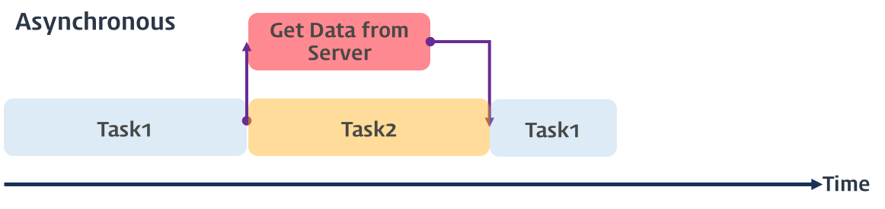

## **동기 처리와 비동기 처리**

### **실행 컨텍스트**


함수가 실행되려면 `함수 코드 평가 과정` 에서 생성된 함수 실행 컨텍스트가 실행 컨텍스트 스택에 푸시되어야 한다. 즉, 실행 컨텍스트 스택에 함수 실행 컨텍스트가 푸시되는 것은 바로 함수 실행의 시작을 의미한다. 함수가 호출된 순서대로 순차적으로 실행되는 이유는 함수가 호출된 순서대로 함수 실행 컨텍스트가 실행 컨텍스트 스택에 푸시되기 때문이다. 이처럼 함수 실행 순서는 실행 컨텍스트 스택으로 관리한다.

자바스크립트 엔진은 단 하나의 실행 컨텍스트 스택을 갖는다. 이는 함수를 실행할 수 있는 창구가 단 하나이며, 동시에 2개 이상의 함수를 실행할 수 없다는 것을 의미한다. 실행 컨텍스트 스택의 최상위 요소인 "실행 중인 실행 컨텍스트" 를 제외한 모든 실행 컨텍스트는 모두 실행 대기 중인 태스크들이다. 대기 중인 태스크들은 현재 실행 중인 실행 컨텍스트가 팝되어 실행 컨텍스트 스택에서 제거되면, 즉 현재 실행 중인 함수가 종료하면 실행되기 시작한다. 자바스크립트 엔진은 한 번에 하나의 태스크만 실행할 수 있는 싱글 스레드 방식으로 동작하므로 처리에 시간이 걸리는 태스크를 실행하는 경우 블로킹(작업 중단)이 발생한다.

&nbsp;

### **동기(Synchronous) 처리**

```javascript
// sleep 함수는 일정 시간(delay)이 경과한 이후에 콜백 함수(func)를 호출한다.
function sleep(func, delay) {
  const delayUntil = Date.now() + delay;
  while (Date.now() < delayUntil);
  func();
}

function foo() {
  console.log("foo");
}

function bar() {
  console.log("bar");
}

// sleep 함수는 3초 이상 실행된다.
sleep(foo, 3 * 1000);

// bar 함수는 sleep 함수의 실행이 종료된 이후에 호출되므로 3초 이상 블로킹 된다.
bar();

// (3초 경과 후) foo 호출 -> bar 호출
```

위 예제의 sleep 함수는 3초 후에 foo 함수를 호출한다. 이때 bar 함수는 sleep 함수의 실행이 종료된 이후에 호출되므로 3초 이상(foo 함수의 실행 시간 + 3초) 호출되지 못하고 블로킹된다.이처럼 `현재 실행 중인 태스크가 종료할 때까지 다음에 실행될 태스크가 대기하는 방식을 동기(Synchronous)처리`라고 한다

&nbsp;


동기 처리 방식은 태스크를 순서대로 하나씩 처리하므로 실행 순서가 보장된다는 장점이 있지만, 앞선 태스크가 종료할 때까지 이후 태스크들이 블로킹되는 단점이 있다.

&nbsp;

&nbsp;

### **비동기(Asynchronous) 처리**

```javascript
function foo() {
  console.log("foo");
}

function bar() {
  console.log("bar");
}

// 타이머 함수 setTimeout은 일정 시간이 경과한 이후에 콜백 함수 foo를 호출한다.
// 타이머 함수 setTimeout은 bar 함수를 블로킹하지 않는다.
setTimeout(foo, 3 * 1000);
bar();
// bar 호출 -> (3초 경과 후) foo 호출
```

`setTimeout` 함수는 위의 `sleep` 함수와 유사하게 일정 시간이 경과한 이후에 콜백 함수를 호출하지만 `setTimeout` 함수 이후의 태스크를 블로킹하지 않고 곧바로 실행한다. 이처럼 `실행 중인 태스크가 종료되지 않은 상태라 해도 다음 태스크를 곧바로 실행하는 방식은 비동기(Asynchronous)처리`라고 한다.

&nbsp;



동기 처리 방식은 태스크를 순서대로 하나씩 처리하므로 실행 순서가 보장된다는 장점이 있지만, 앞선 태스크가 종료할 때까지 이후 태스크들이 블로킹 되어 처리 시간이 늘어날 수 있다는 단점이 있다. 비동기 처리 방식은 현재 실행 중인 태스크가 종료되지 않은 상태라 해도 다음 태스크를 곧바로 실행하므로 블로킹이 발생하지 않고 처리 시간이 단축된다는 장점이 있지만, 태스크의 실행 순서가 보장되지 않는다는 단점이 있다.

&nbsp;

&nbsp;

## **이벤트 루프와 태스크 큐**

### **싱글스레드인 자바스크립트의 비동기가 가능한 이유**

자바스크립트의 특징 중 하나는 싱글 스레드로 동작한다는 것인데, 싱글 스레드는 한 번에 하나의 태스크만 처리할 수 있다는 것을 의미한다. 하지만 브라우저가 동작하는 것을 살펴보면 많은 태스크가 동시에 처리되는 것처럼 느껴진다. `자바스크립트의 동시성을 지원하는 것이 바로 이벤트 루프`이다. `이벤트 루프는 브라우저에 내장되어 있는 기능` 중 하나다.


대부분의 자바스크립트 엔진은 크게 2개의 영역으로 구분할 수 있다.

### **콜 스택**

소스코드 평가 과정에서 생성된 실행 컨텍스트가 추가되고 제거되는 스택 자료구조인 실행 컨텍스트 스택이 바로 콜 스택이다. 함수를 호출하면 함수 실행 컨텍스트가 순차적으로 콜 스택에 푸시되어 순차적으로 실행된다.

### **힙**

힙은 객체가 저장되는 메모리 공간으로, 콜 스택의 요소인 실행 컨텍스트는 힙에 저장된 객체를 참조한다. 메모리에 값을 저장하려면 먼저 값을 저장할 메모리 공간의 크기를 결정해야 한다. 객체는 원시 값과는 달리 크기가 정해져 있지 않으므로 할당해야 할 메모리 공간의 크기를 런타임에 결정(동적 할당)해야 한다. 따라서 객체가 저장되는 메모리 공간인 힙은 구조화되어 있지 않다는 특징이 있다.

&nbsp;

&nbsp;

자바스크립트 엔진은 단순히 태스크가 요청되면 콜 스택을 통해 요청된 작업을 순차적으로 실행할 뿐이다. 비동기 처리에서 소스코드의 평가와 실행을 제외한 모든 처리는 자바스크립트 엔진을 구동하는 환경인 브라우저 또는 Node.js 가 담당한다. 이를 위해 브라우저 환경은 태스크 큐와 이벤트 루프를 제공한다.

### **태스크 큐(task queue / event queue / callback queue)**

`setTimeout` 이나 `setInterval` 같은 비동기 함수의 콜백 함수 또는 이벤트 핸들러가 일시적으로 보관되는 영역이다.

### **이벤트 루프**

콜 스택에 현재 진행 중인 실행 컨텍스트가 있는지, 태스크 큐에 대기 중인 함수(콜백 함수, 이벤트 핸들러 등)가 있는지 반복해서 확인한다. 만약 콜 스택이 비어있고 태스크 큐에 대기 중인 함수가 있다면 `이벤트 루프는 순차적으로(FIFO) 태스크 큐에 대기 중인 함수를 콜 스택으로 이동`시킨다. 이때 콜 스택으로 이동한 함수는 실행된다. 즉, 태스크 큐에 임시 보관된 함수들은 비동기 처리 방식으로 동작한다.

```javascript
function foo() {
  console.log("foo");
}
function bar() {
  console.log("bar");
}

setTimeout(foo, 0); // 0초(실제는 4ms) 후에 foo 함수가 호출된다.
bar();
```

위 예제의 실행 순서를 보면

1. 전역 코드가 평가되어 전역 실행 컨텍스트가 생성되고 콜 스택에 푸시된다.

2. 전역 코드가 실행되기 시작하여 `setTimeout` 함수가 호출된다. 이때 `setTimeout` 함수의 함수 실행 컨텍스트가 생성되고 콜 스택에 푸시되어 현재 실행 중인 실행 컨텍스트가 된다.

3. `setTimeout` 함수가 실행되면 콜백 함수를 호출 스케줄링하고 종료되어 콜 스택에서 팝된다.

   -> 이때 타이머를 설정하고 타이머가 만료되면 콜백 함수를 태스크 큐에 푸시하는 것(호출 스케줄링)은 브라우저의 역할이다.

4. - 브라우저: 타이머를 설정하고 타이머의 만료를 기다린다. 이후 타이머가 만료되면 콜백 함수 `foo` 가 태스크 큐에 푸시된다.

   - 자바스크립트 엔진: `bar` 함수가 호출되어 `bar` 함수의 함수 실행 컨텍스트가 생성되고 콜 스택에 푸시되어 현재 실행 중인 실행 컨텍스트가 된다. 이후 `bar` 함수가 종료되어 콜 스택에서 팝된다.

5. 전역 코드 실행이 종료되고 전역 실행 컨텍스트가 콜 스택에서 팝된다. 이로서 콜 스택에는 아무런 실행 컨텍스트도 존재하지 않게 된다.

6. 이벤트 루프에 의해 콜 스택이 비어 있음이 감지되고 태스크 큐에서 대기 중인 콜백 함수 `foo` 가 이벤트 루프에 의해 콜 스택에 푸시된다. 즉, 콜백 함수 `foo` 의 함수 실행 컨텍스트가 생성되고 콜 스택에 푸시되어 현재 실행 중인 실행 컨텍스트가 된다. 이후 `foo` 함수가 종료되어 콜 스택에서 팝된다.
