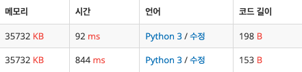
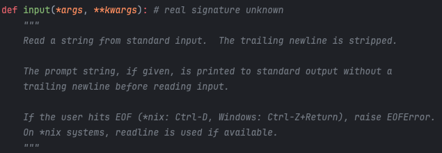
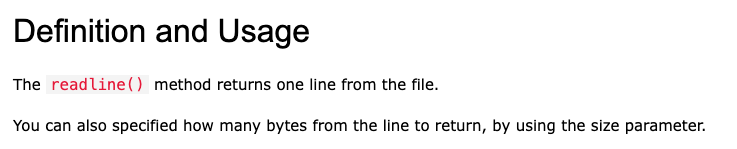

백준 사이트에서 알고리즘 문제를 풀 때는 다른 알고리즘 풀이 사이트와 다르게 입출력을 명시해 줘야 한다. 가장 기본적인 입력 함수는 `input()` 이고, 좀 더 빠른 입력을 위해 사용하는 함수는 `sys.stdin.readline()` 이다.

두 함수의 속도 차이를 크게 느낄 수 있는 문제 하나를 예시로 들자면

## **단어 정렬**

[문제 링크](https://www.acmicpc.net/problem/1181)

단순 문자열 정렬 유형으로, 어렵지 않은 난이도의 문제이다.

&nbsp;

### **처음 풀이**

```python
n = int(input())
lst = list(set([input() for i in range(n)]))
lst.sort(key=lambda x: (len(x), x))
for s in lst:
    print(s)
```

`input()` 함수로 숫자 n 을 입력 받고, n 만큼 루프를 돌려서 역시 `input()` 함수를 통해 문자열을 입력받고, 중복 제거 후 조건에 따라 람다식을 이용해서 정렬 후 차례대로 출력했다.

&nbsp;

### **두번째 풀이**

```python
import sys

n = int(sys.stdin.readline())
lst = list(set([sys.stdin.readline().strip() for i in range(n)]))
lst.sort(key=lambda x: (len(x), x))
for s in lst:
    print(s)
```

시간이 생각보다 오래 걸리는 것 같아서 입력 함수만 변경한 풀이이다.

&nbsp;

두 풀이의 결과는 다음과 같다.

&nbsp;



아래부터 첫 번째 풀이의 결과인데, 겨우 입력 함수만 변경했을 뿐인데 시간 차이가 무려 10배 가까이 났다.

그냥 어렴풋이 `sys.stdin.readline()` 가 빠르다.. 정도만 인식하고 있었는데, 속도 차이가 급격하게 나는 것을 경험한 뒤로는 문제 풀 때 더 이상 기본 `input()` 함수는 사용하지 않고 있다. 뿐만 아니라, 시간제한 기준이 짧은 조금 더 어려운 난이도의 문제를 풀 때는 반드시 `sys.stdin.readline()` 함수를 사용해야 시간 초과가 나지 않았다.

&nbsp;

&nbsp;

### **input()**

ide 에서 `input()` 의 설명을 찾아보면 다음과 같다.



외부로부터 입력을 받으면 문자열 끝에 오는 줄 바꿈 문자(\n) 를 제거한다는 내용이다. 또한, 입력을 받기 전 보여주는 프롬포트 문자열을 출력할 수 있다. 또 한 가지 특징은 `input()` 함수는 입력의 끝 (EOF) 을 만났을 때 EOFError를 던져준다.

&nbsp;

&nbsp;

### **sys.stdin.readline()**

w3school 에서 `readline()` 의 정의를 찾아보면 다음과 같다.



외부로부터 입력을 받으면 한 줄을 그대로 읽어오기 때문에 줄 바꿈 문자(\n) 를 따로 제거하지 않는다. 이러한 특성 때문에 문자열 입력을 여러 개 받을 때는 `strip()` 함수를 추가로 붙여서 줄 바꿈 문자를 제거하게끔 작성해야 한다.

그리고 `input()` 함수와 달리 입력이 끝났어도 따로 에러를 던져주지 않기 때문에 아주 가끔 에러를 발생시켜야 통과되는 문제에서는 `input()` 함수를 사용해야만 한다.
