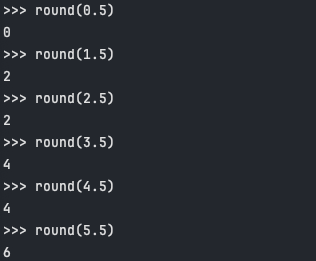

[문제 링크](https://www.acmicpc.net/problem/18110)

문제에 설명된 절사평균이라는 개념을 잘 읽고 적용하면 풀릴 것 같은 문제지만, 파이썬에서 반올림에 흔히 사용되는 `round()` 함수의 미묘한 특성을 알지 못 하면 풀기 힘든 문제이다.

## **round()**

보통 우리가 보편적으로 알고 있는 반올림 방식은 숫자 5 이상부터 올리고, 4 이하부터 내리는 방식인데, 파이썬의 반올림은 가까운 짝수 쪽으로 반올림 하는 방식을 사용한다.



파이썬 쉘에 숫자를 실제로 입력 해보면 생각했던 결과가 나오지 않는 것을 알 수 있다.

## **풀이**

```python
import sys

def n_round(num):
    return int(num) + (1 if num - int(num) >= 0.5 else 0)

n = int(sys.stdin.readline())
if n == 0:
    print(0)
else:
    lst = sorted([int(sys.stdin.readline()) for i in range(n)])
    excl = n_round(n * 0.15)
    print(n_round(sum(lst[excl:n - excl]) / (n - 2 * excl)))
```

`n_round` 함수를 통해 우리가 흔히 사용하는 반올림 방식을 적용시켜서 풀었다.

&nbsp;

여담으로 파이썬에서 사용하는 방식의 반올림을 `은행가 반올림 (Banker’s rounding)` 이라고 하는데, 통계적으로 확률 차이를 줄여주기 때문에 숫자와 돈에 민감한 금융가에서 사용한다고 한다. 또한 파이썬에서만 사용되는 방식도 아니고, C# 과 Java 에서도 이 방식을 사용하고 있다고 한다.
