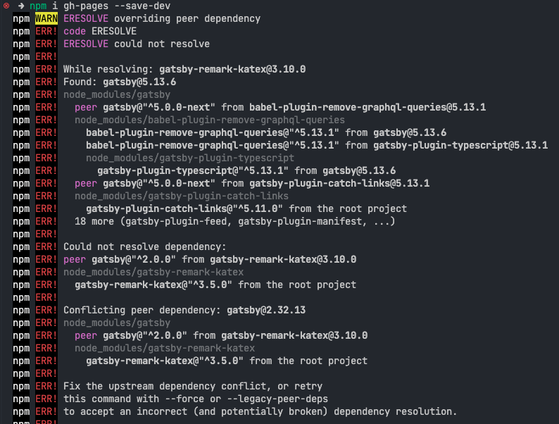
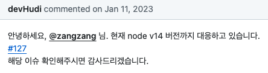
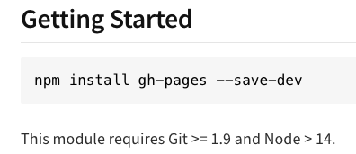
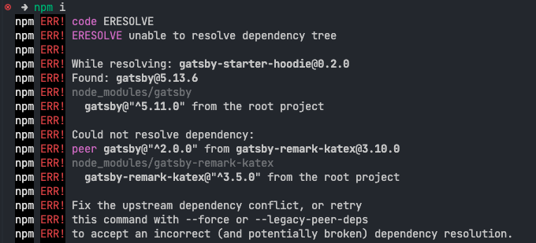
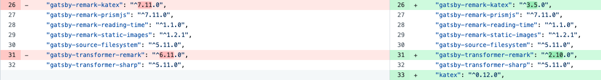

이번에 블로그를 옮기면서 gatsby 를 처음 사용해 봤는데, 큰 문제는 아니었어도 배포 과정에서 겪은 종속성 문제를 기록해보면 좋을 것 같단 생각이 들었다.

문제는 로컬 환경에서 잘 실행되는걸 확인한 프로젝트를 GitHub 에 푸시한 후, 정적 사이트를 호스팅할 수 있는 GitHub Pages 로 배포하는 과정에서 발생했다. [gh-pages](https://github.com/tschaub/gh-pages) 는 프로젝트를 GitHub Pages 에 쉽게 배포할 수 있도록 도와주는 패키지인데, 아주 예전에 팀 프로젝트를 진행할 때 사용해 본 경험이 있어서 또 해당 패키지를 사용하기로 했다.
&nbsp;

&nbsp;

&nbsp;

### **문제1: 프로젝트 Node version**

설치 시도를 하자마자 종속성 문제 에러가 발생했다. 내 로컬 환경 노드 버전이 좀 높기도 했고(20.버전이었다.), 보통 노드 버전 때문에 종속성 문제가 많이 발생하기 때문에 빠르게 레포 이슈를 검색했다.
&nbsp;

&nbsp;

예상처럼 노드 버전을 확인했고, 바로 14 버전으로 다운그레이드 시켜주었다.
&nbsp;

&nbsp;

&nbsp;

&nbsp;

### **문제2: 패키지 Node version**

다시 설치를 시도했는데, 이번에는 `ph-pages` 의 노드 버전이 안 맞는다는 에러가 발생했다. 갑자기 현업 때의 고통이 밀려왔다..
&nbsp;

&nbsp;

확인해 보니 노드 14 버전은 쓸 수 없다고 해서 고민을 했다. Netlify 같은 다른 배포 도구를 사용할지 다른 패키지를 찾아서 배포할지 고민하다 한번 노드 버전을 올려보기로 했고, 20 아래 버전 LTS 인 노드 18로 업그레이드를 해주었다.
&nbsp;

&nbsp;

&nbsp;

### **문제3: 패키지 의존성 충돌**

프로젝트 권장 노드 버전이 아니기 때문에 에러가 발생했고, 이제는 패키지 버전을 살필 차례였다. `gatsby-remark-katex` 는 `gatsby` 의 특정 버전(^2.0.0) 을 필요로 하는데, 현재 프로젝트에는 호환되지 않는 최신 버전(5.13.6) 의 `gatsby` 가 설치되어 있어서 발생하는 문제로 보였다. 단순히 생각했을 때는 패키지의 버전을 올리면 되지 않나 싶었는데, 뭔가 이유가 있어서 낮은 버전으로 사용되고 있을 것 같단 생각이 들었다.
분명 같은 문제가 발생한 사람이 있을 것 같아서 또 레포로 달려가서(...) 검색을 해보니,
&nbsp;

&nbsp;

&nbsp;

gatsby 5 마이그레이션 이후 볼드 처리 문제가 있어서 remark 패키지를 다운 그레이드 했다는 PR 기록이 있었다.
&nbsp;

&nbsp;

&nbsp;

### **요약**

- 노드 버전 포기 -> 원하는 배포 방식 적용 불가능
- 원하는 배포 방식 적용 -> 패키지 의존성 해결 불가능

인 상황이었는데, 사실 패키지 의존성 문제가 발생해서 구글에 검색을 하면 `--legacy-peer-deps` 라는 특정 명령어로 임시 조치하라는 글들이 꽤나 많았기 때문에 해당 명령어로 해결할까 하는 생각도 들긴 했지만.. 현업에서 임시 조치의 부메랑을 맞아본 적이 있어서 조금 더 좋은 해결 방법을 찾고 싶었다.

그래서 한 번 npm 말고 yarn 으로 설치해 볼까? 하는 생각이 들었고, 정말 놀랍게도 yarn 으로 해결이 되었다. (속도도 훨씬 빠른 건 덤..) 그동안 패키지 매니저 관련 글도 많이 봤고, 얼마 전에 토스 기술 블로그에서 [패키지 매니저 관련 글](https://toss.tech/article/lightning-talks-package-manager)도 봤지만, 실제로 패키지 매니저의 종류에 따라 개발에 차질이 생긴 건 처음이라 굉장히 좋은 경험이었다.

하나 의문인 점은 로컬 환경에서 노드 20.13.1 버전으로 프로젝트를 빌드 할 때는 빌드가 잘 됐었는데, 코드를 푸시하고 다른 패키지 설치 시도를 하자마자 멀쩡히 돌아가던 패키지 에러가 발생한 점이다. 아직도 이유를 모르겠다..

게다가 근본적인 종속성 문제를 해결한 건 아니기 때문에 추후에 gatsby 패키지 관련 이슈를 팔로업하면서 의존성 문제가 발생하지 않는 버전으로 업그레이드하는 방식으로 해결해 볼 생각이다.
