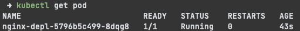
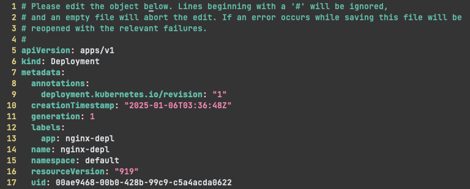
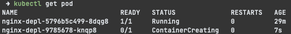
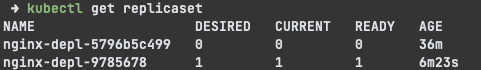
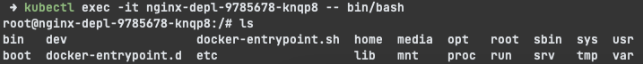

## **미니큐브**

미니큐브(Minikube) 는 `로컬에서 실행 가능한 쿠버네티스`로, 가상 머신을 통해 쿠버네티스를 로컬에서 임의로 실행하여 쿠버네티스를 배울 수 있다. 실무에서 쿠버네티스를 사용하면 보통 여러개의 마스터 프로세스와 노드 프로세스가 여러개의 노드에서 실행되는 클러스터를 구성하게 되는데, 이를 로컬에서 세팅하고 테스트하기는 다소 부담스럽다. 미니큐브는 마스터 프로세스와 노드 프로세스를 하나의 노드에서 실행하기 때문에 간편하게 실습이 가능하다.

### **Kubectl**
Kubectl 은 쿠버네티스를 다룰 수 있는 명령어 도구로, 쿠버네티스 클러스터 API server 에 요청을 보낼 수 있다. Kubectl 로 API Server 에 다양한 요청(컴포넌트 생성, 수정, 제거 등)을 보내게 되면 워커 프로세스에서 해당 명령어를 실행하게 된다.

&nbsp;

### **Minikube 설치**
`brew install minikube` 명령어로 kubectl 까지 모두 설치 가능하다. 설치시 링크 에러가 발생하여 공식 홈페이지에 나와있는대로 다시 unlink-link 해줬다.
```bash
brew unlink minikube
brew link minikube
```
이번에는 brew 에서 m1 프로세서에 맞지 않는 버전을 설치했다고 해서(...) 최신 버전 arm 파일을 직접 다운로드 받아 설치해줬다. 
```bash
curl -LO https://storage.googleapis.com/minikube/releases/latest/minikube-darwin-arm64
sudo install minikube-darwin-arm64 /usr/local/bin/minikube
```
&nbsp;

### **Minikube 시작**
`minikube start --driver=docker` 로 미니큐브를 도커에 띄운다.

파드를 생성하기 위해서는 deployment 를 생성해야 하는데, deployment 가 파드를 관리하는 상위 리소스이기 때문이다. 예시로 nginx 를 이미지로 지정하여 deployment 를 생성한다.

`kubectl create deployment nginx-depl --image=nginx`

deployment 를 생성할 때 쿠버네티스에서 자동으로 replicaset(레플리카셋)을 생성하게 되는데, 레플리카셋은 정의된 수의 파드를 생성하여 deployment 가 요청한 상태를 유지하게 된다.




각각의 파드 이름을 확인해보면 이름이 조금 다름을 알 수 있다.

&nbsp;

정리하자면, 쿠버네티스는 다음과 같은 추상 레이어를 가진다.


1. `deployment` 는 더 하위 수준의 replicaset 객체가 특정 수의 pod 를 실행하고 유지하도록 replicaset 을 생성하거나 관리한다.
2. `replicaset` 은 deployment 에 의해 제어되며 더 하위 수준의 파드를 관리한다. 파드의 복제본 수를 유지하는 역할을 담당하며, 파드의 생성, 삭제를 관리한다.
3. `pod` 는 쿠버네티스에서 실행 가능한 애플리케이션의 기본 단위로, replicaset 이 생성하고 관리한다.

&nbsp;

deployment 하위의 객체들은 쿠버네티스에서 관리하기 때문에 신경쓰지 않아도 된다. 만약 수정하고 싶은 부분이 있다면, configuration 수정을 통해 변경 가능하다.

`kubectl edit deployment nginx-depl` 명령어를 통해 자동 생성된 configuration 파일에 접근할 수 있다.



수정하고 싶은 부분을 수정한 후, 저장해주면 자동으로 파드에 변경이 이루어진다.



변경이 적용된 파드가 생성되고 있음을 알 수 있다.

&nbsp;



레플리카셋을 확인해보면, 이전에 생성됐었던 객체에는 더이상 파드가 존재하지 않고, 새로 생성된 파드만 있음을 알 수 있다.

&nbsp;

`kubectl exec -it nginx-depl-9785678-knqp8 -- bin/bash` 을 통해 특정 파드에 접속할 수 있다.



셸에 접속 후, 명령어를 실행하거나 필요한 파일을 확인할 수 있다.

&nbsp;

### **configuration file**
위에서 `kubectl create` 명령어로 리소스를 생성했지만, 다양한 옵션을 추가해야 한다면 cli 로 모든 옵션을 추가하기는 어렵다. 일반적으로 쿠버네티스 리소스 정의에는 yaml 형식의 configuration 파일이 사용된다. 해당 파일 정의 후 apply 해주면 필요한 리소스를 생성 가능하다.

```yaml
apiVersion: apps/v1
kind: Deployment
metadata:
  name: nginx-deployment
spec:
  replicas: 3
  selector:
    matchLabels:
      app: nginx
  template:
    metadata:
      labels:
        app: nginx
    spec:
      containers:
        - name: nginx
          image: nginx:latest
          ports:
            - containerPort: 80
```
configuration 파일은 몇가지 부분으로 나뉜다.

1. metadata: 이름 등이 정의된다.
2. specification: 리소스를 구성하고 설정하는 부분으로, 해당 리소스가 어떻게 동작해야 하는지에 대한 정보를 담고 있다.
3. status: 리소스의 현재 상태를 나타내는 부분으로, 파일 작성 시는 존재하지 않으며, apply 시 쿠버네티스가 자동 생성한다. 쿠버네티스는 status 의 내용을 지속적으로 갱신하는데, status 와 정의된 내용을 비교하여 일치하지 않는다면 리소스의 상태를 정의된 내용에 일치하도록 수정하게 된다. 이때 활용되는 status 데이터는 클러스터의 뇌와 같은 역할을 하는 etcd 에 저장된다.