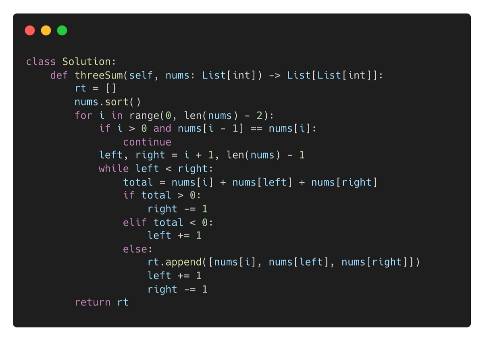
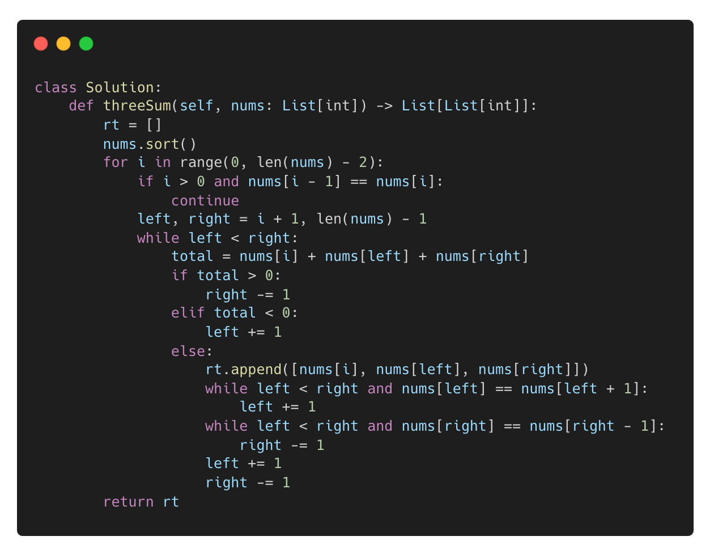
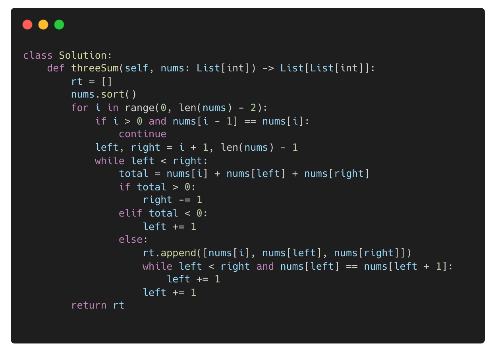

[문제 링크](https://leetcode.com/problems/3sum/description/)

배열을 입력받아 합으로 0을 만들 수 있는 3개의 요소를 배열로 감싸서 출력하는 문제이다.

가장 처음 든 풀이법은 역시 브루트포스였지만 시간복잡도 때문에 타임아웃이 발생할 것 같아서 다른 방법으로 접근하기로 했고, 2Sum 풀 때처럼 투 포인터 방식으로 풀면 되겠다는 판단이 들었다.

### _**첫번째 풀이**_

인풋 배열을 정렬시킨 후, 첫 수를 고정시키고 나머지 두 수를 첫 수의 바로 다음 수와 가장 마지막 수로 고정, 투 포인터 방식으로 단계별로 증감시키는 방식이다.

첫 수를 고정시키고 나머지 수까지의 합을 구하는 방식이기 때문에 첫 수가 중복인 경우는 스킵했고, 수의 합을 0 과 비교해서 포인터를 이동시켰다.

이 풀이의 문제점은 이 \[-2,0,0,2,2\] 처럼 포인터를 이동한 결과가 중복되는 경우를 처리하지 못 한다는 점이었다.

&nbsp;

### _**두번째 풀이**_

중복 추가되는 경우를 방지하기 위해 세 수의 합이 0인 경우, 포인터를 이동시켜서 동일 값 여부를 확인하는 코드를 추가했다.

&nbsp;

### _**세번째 풀이**_

좀 더 들여다보니 꼭 두개의 포인터 모두 이동시킬 필요는 없어서 오른쪽 포인터를 이동시키는 코드는 제거했다.
