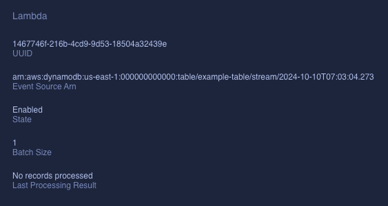

AWS 를 다룰 때, 특정 기능 구현에 필요한 리소스는 AWS 콘솔에서 쉽게 생성하여 테스트할 수 있다. 그러나 이번에 DynamoDB 를 처음 써보았기 때문에 ddb 를 사용하여 Lambda 를 트리거 하는 가장 간단한 방법인 stream 활성화를 로컬에서 테스트해 보고 싶었다.

AWS 콘솔이 아닌 로컬에서 리소스 기능을 테스트하는 대표적인 방법에는 AWS SAM 을 사용하는 것이 있다.
AWS SAM(Serverless Application Model) 은 AWS CloudFormation 의 확장 기능으로, `template.yaml` 에 정의된 SAM 템플릿은 내부적으로 CloudFormation 템플릿으로 변환되어 AWS 리소스를 배포하게 된다. 다만 이번 작업에서 핵심적으로 확인하고 싶은 기능인 ddb stream 은 SAM local 에서 테스트가 불가능하기 때문에 localstack 을 사용하기로 했다.

&nbsp;

## **Localstack**

[Localstack 공식 문서](https://docs.localstack.cloud/user-guide/aws/dynamodbstreams/) 에 DynamoDB 생성 후 Lambda 와 연결까지 하는 과정이 잘 설명되어 있다.

### **DynamoDB stream 활성화**

처음 작업을 시작할 때, 이미 내 로컬에는 도커로 띄워둔 로컬 ddb 가 있는 상태였다. 따라서 localstack 에 ddb 부터 띄우는 것이 아니라, lambda 만 추가로 생성하여 이벤트 소스 연결 후, 테스팅하는 방법을 시도했다.

&nbsp;

ddb 에 lambda 를 트리거 할 주체가 되는 테이블을 추가할 때, stream 을 활성화하는 옵션을 넣어야 한다.

```json
"StreamSpecification": {
  "StreamEnabled": true,
  "StreamViewType": "NEW_AND_OLD_IMAGES"
}
```

- `StreamSpecification` 은 ddb 테이블의 stream 기능을 활성화하는 속성이다.
- `StreamEnabled` 을 true 로 설정하면 stream 기능이 활성화되고, 테이블의 데이터 변경 사항을 스트림으로 기록할 수 있게 된다.
- `StreamViewType` 은 스트림으로 기록되는 데이터 변경 사항의 종류를 지정하는 속성이다. 내 경우는 데이터 추가, 수정, 삭제 시를 기록하기 위해 `NEW_AND_OLD_IMAGES` 로 지정했다.

&nbsp;

aws cli 명령어로 dynamoDB 테이블을 생성하면 테이블에 대한 정보를 볼 수 있는데, 이때 lambda 를 트리거 할 이벤트 소스를 얻을 수 있다.

```bash
"LatestStreamArn": "arn:aws:dynamodb:ddblocal:000000000000:table/example-table/stream/2024-10-09T16:48:34.325"
```

&nbsp;

&nbsp;

### **Localstack 실행**

stream 활성화 옵션을 추가한 테이블이 생성되면, 해당 테이블이 트리거 할 lambda 를 localstack 환경에 생성하기 위해 localstack 을 docker 에 띄운다.

```bash
docker run --rm -it \
  -e SERVICES=lambda \
  -p 4566:4566 \
  -p 4571:4571 \
  --name localstack localstack/localstack
```

위에서 언급했듯이 ddb 는 로컬에서 돌아가고 있었기에 Lambda 만 활성화하였다.

&nbsp;

```bash
awslocal lambda create-function \
  --function-name processDynamoDBStream \
  --zip-file fileb://index.zip \
  --handler index.handler \
  --runtime nodejs18.x \
  --role arn:aws:iam::000000000000:role/lambda-role
```

실행 중인 localstack 에 lambda 함수를 processDynamoDBStream 라는 이름으로 생성해준다.

&nbsp;

```bash
awslocal lambda create-event-source-mapping \
  --function-name processDynamoDBStream \
  --event-source-arn arn:aws:dynamodb:ddblocal:000000000000:table/example-table/stream/2024-10-09T16:48:34.325 \
  --batch-size 1 \
  --starting-position TRIM_HORIZON
```

해당 람다에 위의 stream arn 을 맵핑해준다.

&nbsp;

&nbsp;

## **Local DynamoDB region 이슈**

위의 과정을 거치면 아래의 에러 메세지를 확인할 수 있다.

```bash
WARN --- [et.reactor-0] l.aws.handlers.region
: Region 'ddblocal' is not available. Resetting the region to 'us-east-1'.
Please consider using a region in the 'aws' partition to avoid any unexpected behavior.
Available regions: ['af-south-1', 'ap-east-1', 'ap-northeast-1', 'ap-northeast-2',
'ap-northeast-3', 'ap-south-1', 'ap-south-2', 'ap-southeast-1', 'ap-southeast-2',
'ap-southeast-3', 'ap-southeast-4', 'ap-southeast-5', 'ca-central-1', 'ca-west-1',
'eu-central-1', 'eu-central-2', 'eu-north-1', 'eu-south-1', 'eu-south-2', 'eu-west-1',
'eu-west-2', 'eu-west-3', 'il-central-1', 'me-central-1', 'me-south-1',
'sa-east-1', 'us-east-1', 'us-east-2', 'us-west-1', 'us-west-2']
```

localstack 은 aws 와 유사하게 동작하게 되므로, 람다와 연결하려는 arn region 이 aws 에 등록된 region 중 하나가 아니면 연결하지 못한다는 의미였다. region 변경을 시도했으나, `aws configure` 명령어를 통해 region 을 임의로 변경하더라도 도커로 ddb 를 띄우면 여전히 로컬에서의 region 은 고정되어 있었다. 따라서 localstack 으로 lambda 만 따로 생성하는 것이 아니라, ddb 부터 함께 생성하는 방식으로 방향을 변경했다.

&nbsp;

### **DynamoDB 와 Lambda 생성**

```bash
docker run --rm -it \
  -e SERVICES=dynamodb,lambda \
  -p 4566:4566 \
  -p 4571:4571 \
  --name localstack localstack/localstack
```

lambda 와 dynamodb 둘 다 Localstack 에서 실행한다.

&nbsp;

동일하게 stream 활성화 옵션이 있는 테이블을 ddb 에 추가하면

```bash
"LatestStreamArn": "arn:aws:dynamodb:us-east-1:000000000000:table/example-table/stream/2024-10-10T07:03:04.273"
```

위의 arn 을 얻을 수 있다. 처음과 다른 점은 ddblocal 이 아닌, localstack 기본 region 인 `us-east-1` 이 적용되어 있다는 점이다.

&nbsp;

ddb 에 테이블 추가 후, 위와 동일한 과정으로 lambda 함수 생성 후 arn 을 연결해 준다.


성공적으로 이벤트 소스가 맵핑되었고,

&nbsp;



localstack gui 에서도 해당 정보를 확인할 수 있다.

&nbsp;

## **Docker network 이슈**

ddb 를 lambda 에 연결한 후, 정상적으로 lambda 가 invoke 되는지 확인하기 위해 테이블에 데이터를 저장했는데, 또 다른 이슈가 있었다.

```bash
ERROR --- [et.reactor-2] l.services.lambda_.hints   :
Failed to create the runtime executor for the function processDynamoDBStream.
Please ensure that Docker is available in the LocalStack container by adding
the volume mount "/var/run/docker.sock:/var/run/docker.sock" to your LocalStack startup.
Check out https://docs.localstack.cloud/user-guide/aws/lambda/#docker-not-available
```

에러 메세지에 있는 문서를 확인해 보니 현재 람다 함수가 local executor mode, 즉 로컬 실행 모드에서 실행 중인데, 이는 람다 함수가 도커를 사용하지 않고 localStack 컨테이너 내에서 직접 실행되는 모드를 의미하는 것이다. 따라서, localStack 을 실행할 때 Docker 소켓을 올바르게 마운트하도록 실행해 주면 문제를 해결할 수 있다.

&nbsp;

### **Docker 소켓 마운트**

- Docker 데몬: [해당 링크](https://www.geeksforgeeks.org/what-is-docker-daemon/)에서 자세한 설명을 볼 수 있다. Docker 컨테이너를 관리하고 실행하는 핵심 컴포넌트라고 이해하면 된다.
- Docker 소켓: Docker 데몬과의 통신을 위해 사용되는 Unix 소켓으로, 이 소켓을 통해 Docker 컨테이너는 호스트 시스템에서 실행 중인 Docker 데몬과 상호작용할 수 있다.
- 마운트: Docker 컨테이너가 호스트 시스템의 파일이나 디렉터리에 접근할 수 있도록 연결하는 과정이다. 소켓 파일을 마운트하면, 컨테이너 내의 프로세스가 호스트의 Docker 데몬에 접근할 수 있다.
- LocalStack 은 AWS Lambda 와 같은 기능을 에뮬레이션 하는 데 Docker 를 사용하므로 LocalStack 이 Lambda 함수를 Docker 환경에서 실행하기 위해서는 Docker 소켓에 접근할 수 있어야 한다.

&nbsp;

```bash
docker run --rm -it \
  --network sam \
  -e SERVICES=dynamodb,lambda \
  -p 4566:4566 \
  -p 4571:4571 \
  -v /var/run/docker.sock:/var/run/docker.sock \
  --name localstack localstack/localstack
```

`-v /var/run/docker.sock:/var/run/docker.sock` 옵션을 추가하여 localstack 을 실행한다. 이 옵션은 Docker 소켓 파일(/var/run/docker.sock)을 LocalStack 컨테이너 내의 동일한 경로에 연결한다. 이렇게 하면 LocalStack이 Docker를 사용하여 Lambda 함수를 실행할 수 있게 된다.

&nbsp;

옵션 변경 후 다시 람다를 invoke 하게 되면 정상적으로 테이블에 데이터가 저장되면서 람다가 invoke 됐음을 확인할 수 있다.


`aws.putItem` 이 람다를 실행했고, 람다가 invoke 되어 로그가 찍혔음을 확인할 수 있다.
