## **최소비용 신장 트리 (MST, Minimum Spanning Tree)**

무방향 (양수) 가중치 그래프면서 엣지들에 의해 그래프의 모든 정점들이 서로 연결되면서 가중치의 합이 최소가 되는 트리

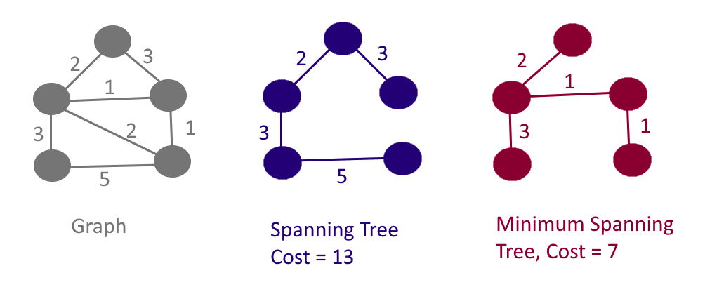

- 사이클(cycle) 이 없는 연결된(connected) 무방향 그래프를 트리라고 한다.
- 우리가 보통 말하는 트리(ex 이진트리) 는 rooted tree 라고 부른다.
- 가중치의 합이 최소이기 위해서는 싸이클이 없어야 하므로 MST 문제의 답은 항상 트리가 된다.
- 노드가 n 개인 트리는 항상 n-1 개의 엣지를 가진다.
- MST 는 유일하지 않다.

## **Generic MST 알고리즘**

MST 를 찾을 수 있는 두 가지 알고리즘 (Kruskal’s Algorithm, Prim’s Algorithm) 의 공통된 근본 알고리즘으로 **어떤 MST 의 부분집합 A 에 대해서 A 에 다른 엣지 (u, v) 를 추가해도 어떤 MST 의 부분집합이 될 경우 엣지 (u, v) 는 A 에 대해서 안전하다(safe)** 고 한다.

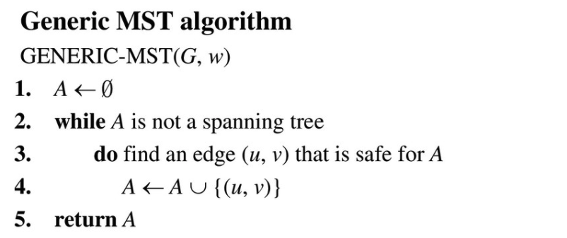

```graphql
1. 처음에는 A 가 공집합이다.
2. A 가 MST 가 되기 전까지 (엣지의 개수가 n-1 개가 되기 전까지)
3. 안전한 엣지 (u, v) 를 찾아서
4. A 와 합친다.
5. 엣지의 개수가 n-1 개에 도달하면 A 를 반환한다.
```

&nbsp;

### **안전한 엣지 찾기**

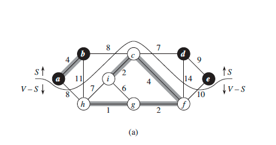

- 그래프의 정점들을 두 개의 집합 S 와 V-S 로 분할한 것을 **컷(cut)**(S, S-V) 라고 부른다.
- 엣지 (u, v) 에 대해서 u 는 S 에 속하고 v 는 S-V 에 속할 때 엣지 (u, v) 는 컷(S, S-V)을 **cross 한다**고 한다.
- 엣지들의 부분집합 A 에 속한 어떤 엣지도 컷(S, S-V) 를 cross 하지 않을 때 A 는 컷(S, S-V) 을 **존중한다(respect)**고 한다.
- 만약 어떤 엣지의 값이 cut 을 가로지르는 엣지 중에 가장 작다면 그 엣지를 **가벼운 엣지(light edge)** 라고 부른다.

&nbsp;

### **증명**

A 가 어떤 MST 의 부분집합이고, (S, V-S) 는 A 를 존중하는 컷이라고 할 때, 이 컷을 cross 하는 엣지들 중 가장 가중치가 작은 엣지 (u, v) 는 A 에 대해서 안전하다.

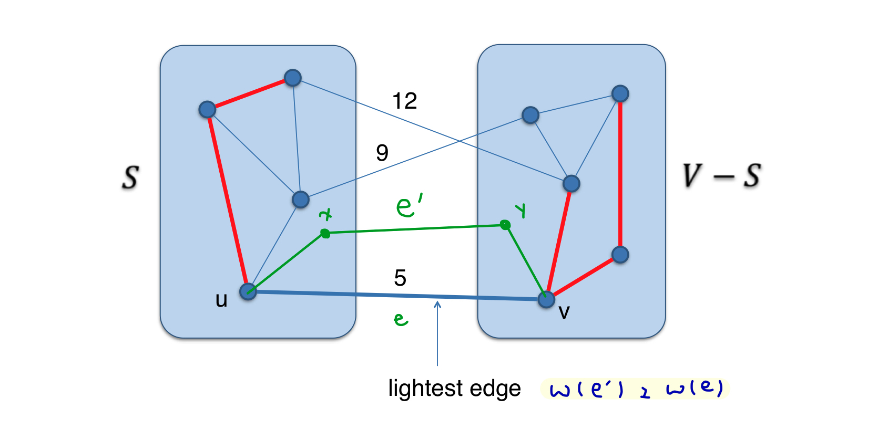

- A 가 어떤 MST 의 부분집합이므로 A 를 포함하는 MST 가 존재하며, MST 는 모든 정점이 연결되어 있어야 하므로 S 와 V-S 에 있는 A 의 엣지들을 잇는 엣지 e’ 가 존재한다고 가정한다.
- 가중치가 가장 작은 엣지 (u,v) 를 e 라고 하면 w(e’) ≥ w(e) 이다.
- 엣지 e’ 대신 e 를 A 의 일부로 삼아도 가중치의 합은 동일하거나 감소하게 된다.
- MST 는 가중치의 합이 최소이므로 엣지 e 는 A 에 대해 안전하다.

&nbsp;

&nbsp;

## **Kruskal 의 알고리즘**

- 엣지들은 가중치의 오름차순으로 정렬한다.
- 엣지들을 그 순서대로 하나씩 선택해 나간다. 단, 이미 선택된 엣지들과 사이클(cycle)을 형성하면 선택하지 않는다.
- n-1 개의 엣지가 선택되면 종료한다.

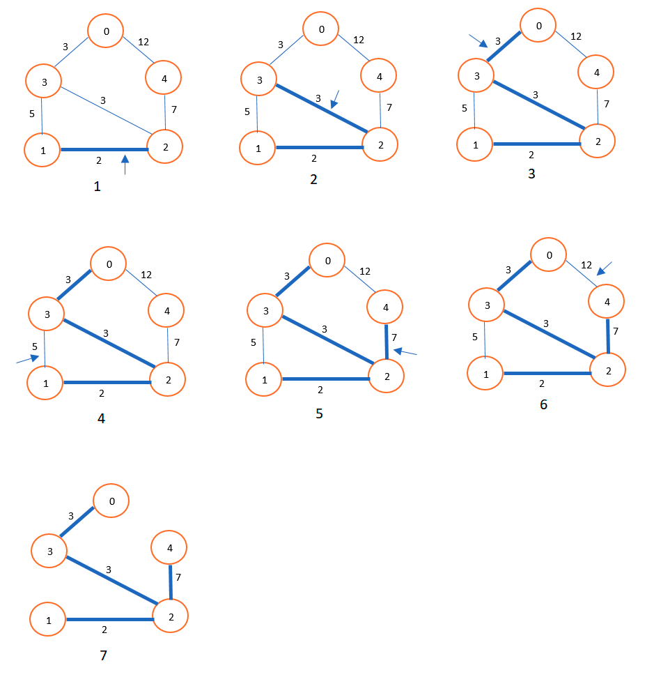

### **증명**

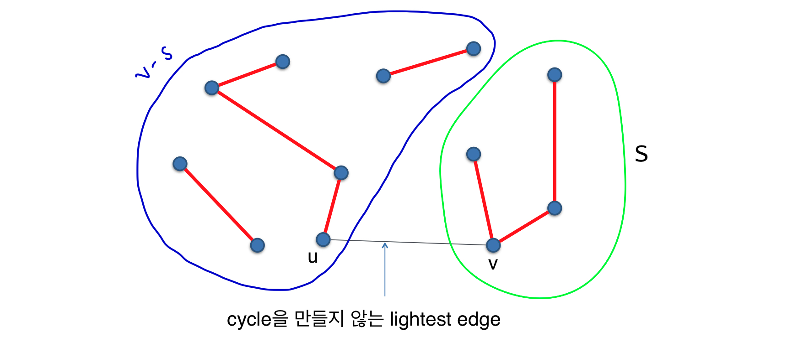

- Kruskal 의 알고리즘의 임의의 한 단계를 생각해본다.
- A 를 현재까지 알고리즘이 선택한 엣지의 집합이라고 하고, A 를 포함하는 MST 가 존재한다고 가정한다.
- (S, V-S) 는 A 를 존중하는 컷이라고 할 때, 이 컷을 cross 하는 엣지들 중 가장 가중치가 작은 엣지 (u, v) 는 A 에 대해서 안전하다. → **Generic MST 알고리즘**
- (S, V-S)를 cross 하는 엣지들 중 가장 가중치가 작은 엣지 (u, v) 가 Kruskal 의 알고리즘이 선택하는 엣지이므로 해당 엣지가 A 와 합쳐져도 A 는 여전히 MST 이다.

&nbsp;

### **사이클 검사**

- 초기 상태 : 선택된 엣지 없음 (A 는 공집합)
- 각각의 연결요소를 하나의 집합으로 표현한다.
- 사이클은 이미 연결된 노드를 다시 연결할 때 생긴다.

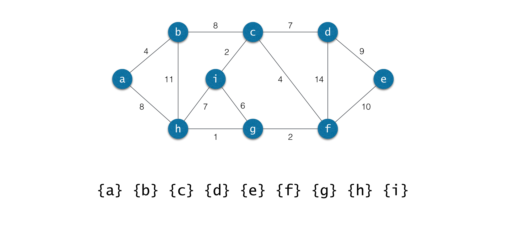

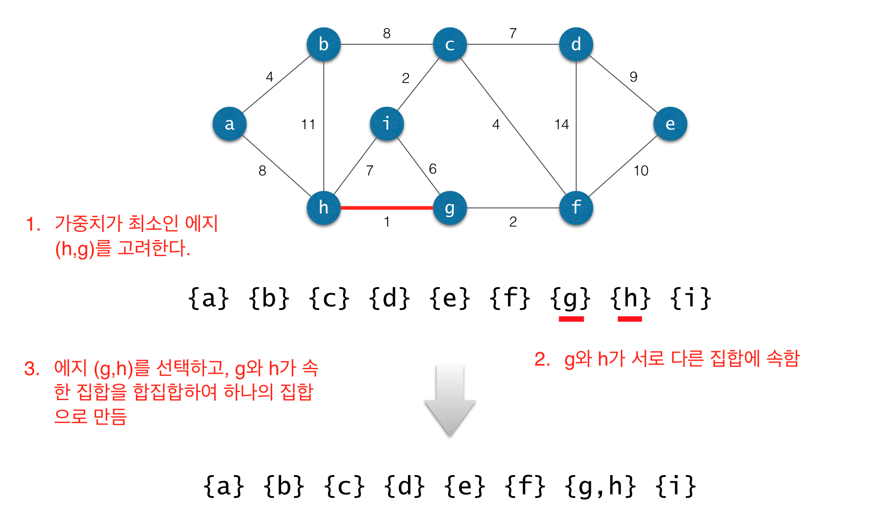

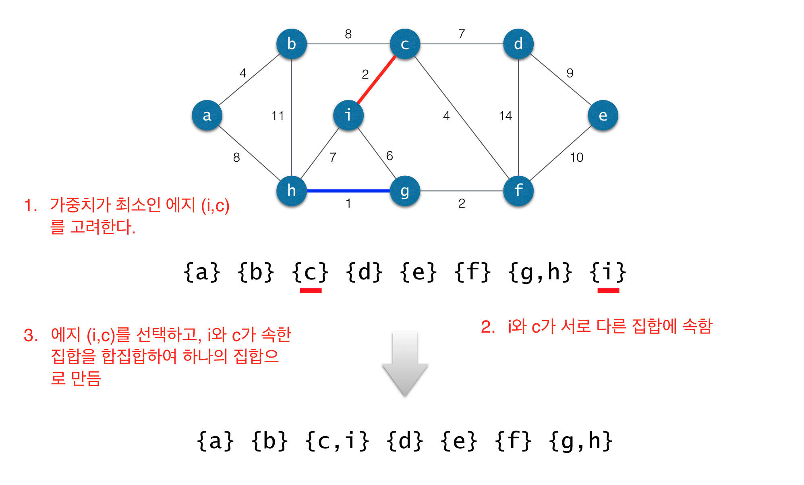

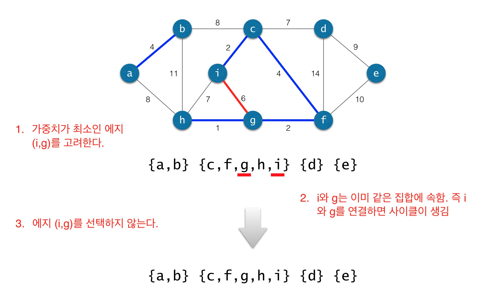

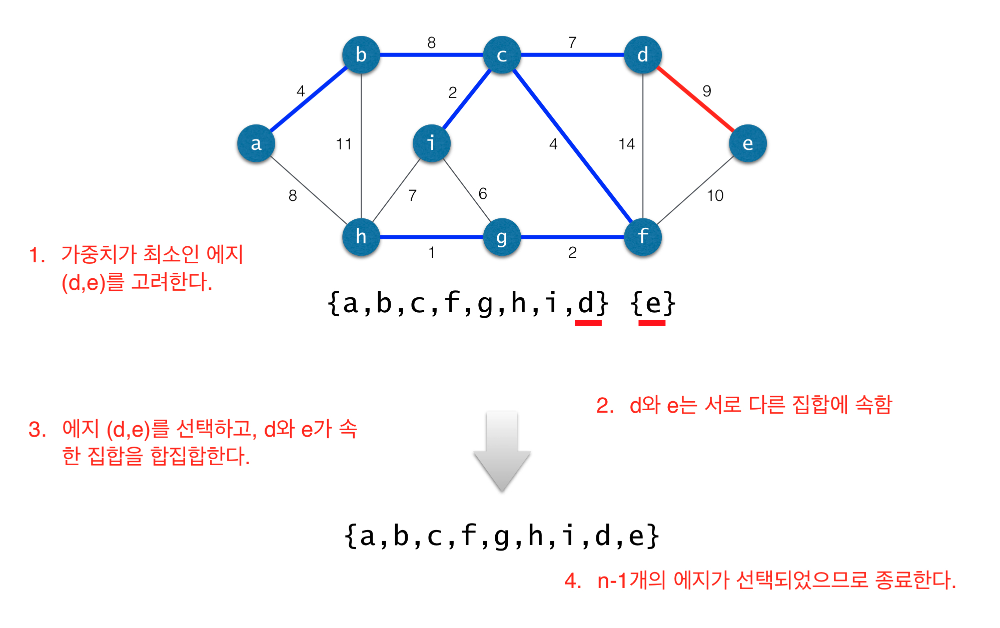

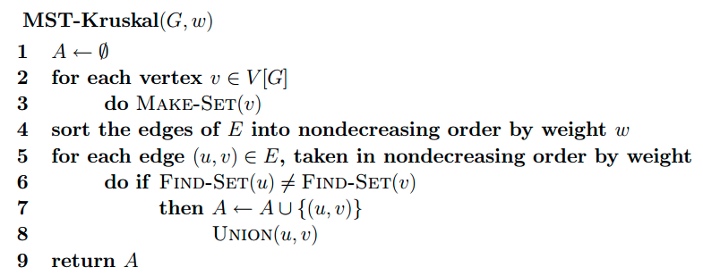

```graphql
1. 처음에는 A 가 공집합이다.
2. 그래프의 모든 정점 v 에 대하여
3. 각각의 노드들을 유일한 원소로 가지는 집합을 만든다. (초기화)
4. 엣지들을 가중치의 오름차순으로 정렬한다.
5. 정렬된 엣지들을 가중치의 오름차순으로 하나씩 확인한다.
6. 하나의 엣지에 있는 노드들이 각각 다른 집합에 속할 때
7. A 에 해당 엣지를 추가한다.
8. 각 노드가 속한 집합을 하나로 합친다.
9. 엣지의 개수가 n-1 개에 도달하면 A 를 반환한다.
```

&nbsp;

## **서로소 집합 (Disjoint Set)**

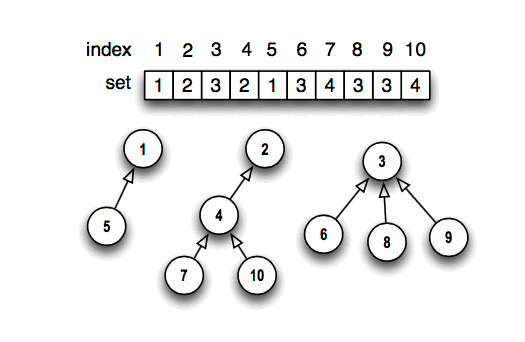

- 각 집합을 하나의 트리로 표현한다 → {1, 5}, {2, 4, 7, 10}, {3, 6, 8, 9}
- 집합의 각 원소들이 트리의 노드가 되는데, 루트 여부나 부모 자식 관계도 상관이 없다.
- 아래 → 위로 진행하는 상향식 트리이기 때문에 트리의 각 노드는 자식 노드가 아닌 부모 노드의 주소를 가진다.
- 모든 트리를 하나의 배열로 표현한다.

&nbsp;

### **Find-Set(v)**

자신이 속한 트리의 루트를 찾는다.

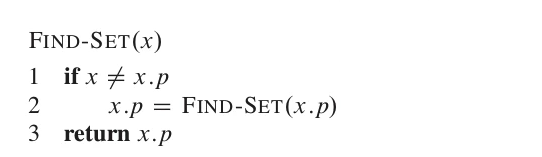

```graphql
1. x 가 x 의 부모가 아니면
2. x 의 부모가 속한 트리를 다시 검사한다.
3. x 의 부모가 x 라면(x 가 트리의 루트라는 의미) x 의 부모를 반환한다.
```

&nbsp;

### **Union-Set(u, v)**

한 트리의 루트를 다른 트리의 루트의 자식 노드로 만든다.

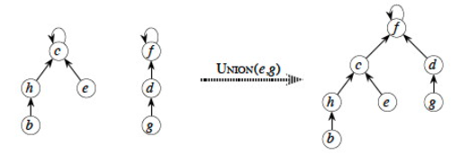

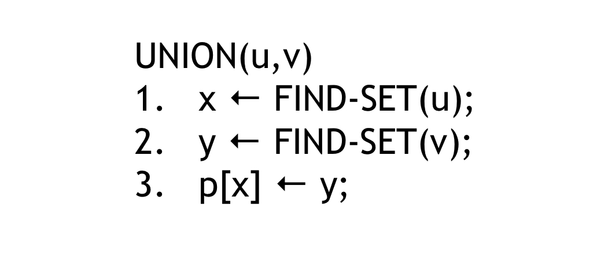

```graphql
1. u 가 속한 트리의 루트 x 를 찾는다.
2. v 가 속한 트리의 루트 y 를 찾는다.
3. y 를 x 의 부모로 한다.
```

&nbsp;

### **Weighted Union**

두 집합을 합칠 때 트리의 높이를 낮게 유지해야 하므로 작은 트리의 루트를 큰 트리의 루트의 자식으로 만든다.

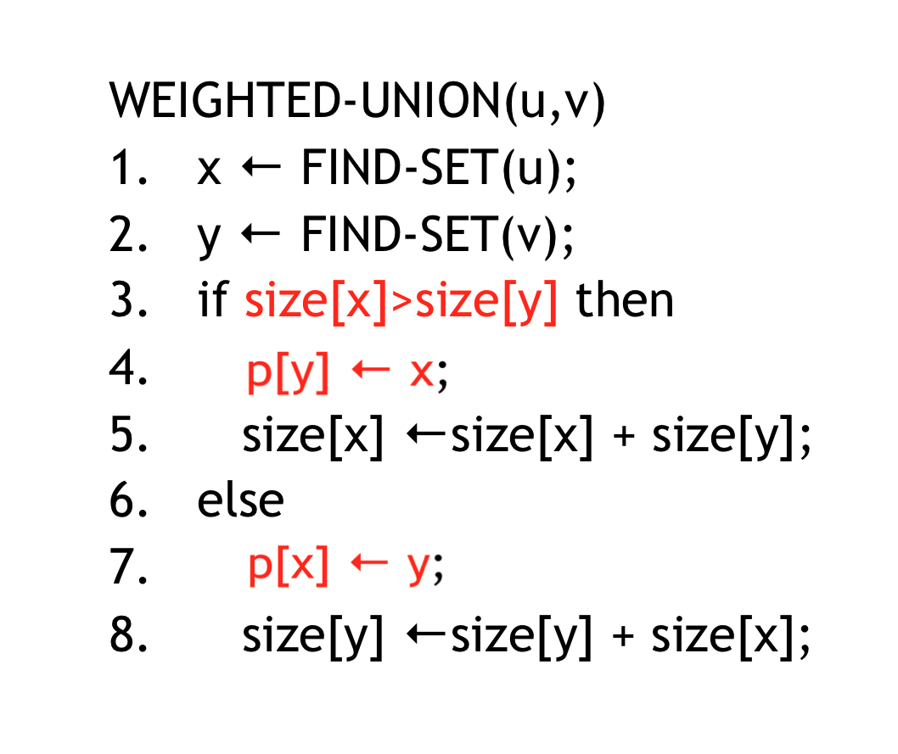

### **Path Compression (경로 압축)**

특정 노드에서 트리의 루트까지 탐색할 때, 지나간 노드들을 투트 노드의 자식으로 붙여서 루트의 높이를 줄인다.

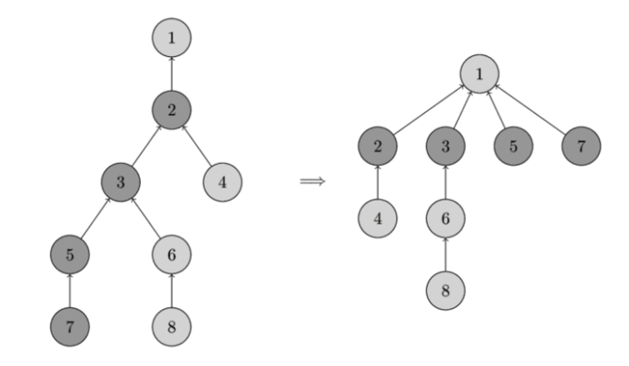

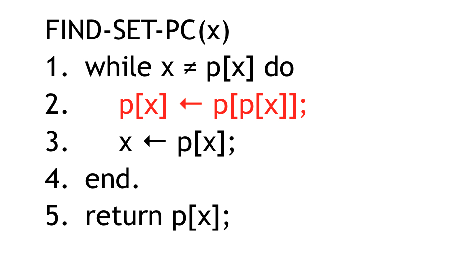

## **Prim 의 알고리즘**

- 임의의 노드를 출발 노드로 선택한다.
- 출발 노드를 포함하는 트리를 점점 키워간다.
- 매 단계에서 이미 트리에 포함된 노드와 포함되지 않은 노드를 연결하는 엣지들 중 가장 가중치가 작은 엣지를 선택한다.

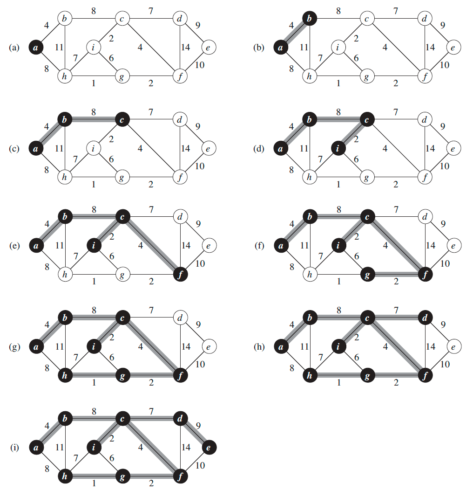

### **증명**

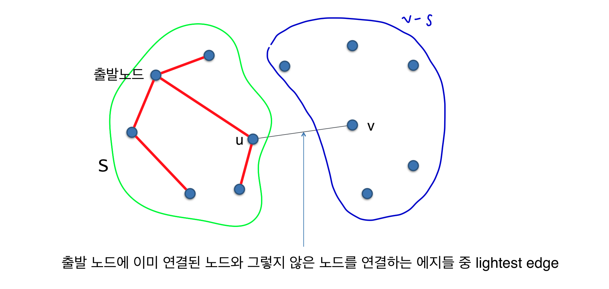

- Prim 의 알고리즘의 임의의 한 단계를 생각해본다.
- A 를 현재까지 알고리즘이 선택한 엣지의 집합이라고 하고, A 를 포함하는 MST 가 존재한다고 가정한다.
- (S, V-S) 는 A 를 존중하는 컷이라고 할 때, 이 컷을 cross 하는 엣지들 중 가장 가중치가 작은 엣지 (u, v) 는 A 에 대해서 안전하다. → **Generic MST 알고리즘**
- (S, V-S)를 cross 하는 엣지들 중 가장 가중치가 작은 엣지 (u, v) 가 Prim 의 알고리즘이 선택하는 엣지이므로 해당 엣지가 A 와 합쳐져도 A 는 여전히 MST 이다.

&nbsp;

### **가중치가 최소인 엣지 찾기**

- VA : 이미 트리에 포함된 노드들
- VA 에 아직 속하지 않은 각 노드 v 에 대하여 key 와 π 의 값을 유지한다.
  - key(v) : 이미 VA 에 속한 노드와 자신을 연결하는 엣지들 중 가중치가 최소인 엣지 (u, v) 의 가중치
  - π(v) : 엣지 (u, v) 의 끝점 u

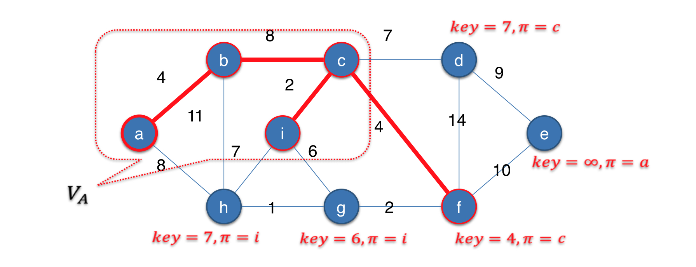

- 가중치가 최소인 엣지 대신 key 값이 최소인 노드를 찾는다.
- key 값이 최소인 노드 f 를 찾고, 엣지 (f, π(f)) 를 선택한다.

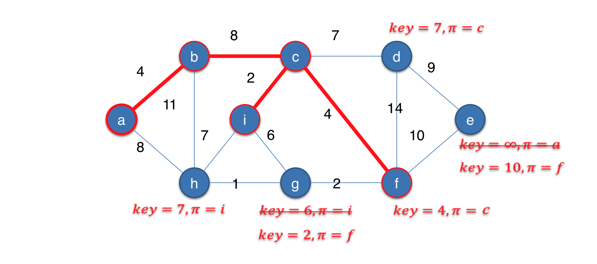

- 추가한 노드의 인접한 노드들 중 key 값이 더 작아지는 경우 갱신한다 → 노드 ~~d~~, g, e 의 값을 갱신한다.
- 최소 우선순위 큐를 사용한다 → 노드들을 저장한 후, key 값이 최소인 노드를 삭제하고 반환한다.

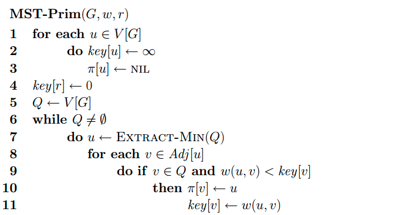

```graphql
1. 그래프의 모든 정점 v 에 대하여
2. key 값을 무한대로 둔다.
3. π 는 null 로 둔다. (초기화)
4. 출발점 r 의 key 값을 0로 둔다.
5. 모든 노드를 우선 순위 Queue 에 넣는다.
6. Queue 가 비어있지 않은 동안에
7. Queue 에서 최소값 u 를 찾는다.
8. Queue 에서 u 의 인접한 노드 v 에 대하여
9. v 가 아직 VA 에 속해있지 않으면서 u 의 키 값보다 엣지(u, v) 의 가중치가 작다면
10. v 의 π 를 u 로 한다.
11. v 의 key 를 엣지(u, v) 의 가중치로 한다.
```
