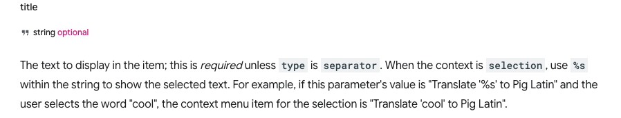

&nbsp;

몇 달 전에 개인 사용 용도로 크롬 확장 프로그램을 만든 이후로 요긴하게 잘 사용해 왔다. 최근에 공부에 쏟는 시간이 늘어나면서 특정 문서를 읽다가 해당 내용을 유튜브 검색을 통해 딥다이브 하게 되는 일이 잦아졌는데, 검색어를 복사하고 붙이는 과정 없이 바로 유튜브로 해당 검색어의 결과 페이지가 열리면 좋겠다고 생각했다. 아마도 간단한 작업일 것이라고 생각해서 필요성을 느끼고 얼마 지나지 않아 기능을 추가하게 되었다.

&nbsp;

## _**개발 과정**_

### _**manifest.json**_

내가 원하는 기능은 검색어 드래그 후 오른쪽 클릭을 통해 메뉴를 열고, 검색을 진행하는 것이었기에 오른쪽 클릭 시 열리는 메뉴를 먼저 추가해야 했다. 해당 기능은 [contextMenus](https://developer.chrome.com/docs/extensions/develop/ui/context-menu) 라는 기능으로, `contextMenus` 를 추가하려면 가장 먼저 `manifest.json` 파일에 권한을 추가해야 한다.

```json
"permissions": [
  "contextMenus"
],
"icons": {
  "16": "icon.png",
},
```

메뉴에 아이콘도 함께 보여주기 위해서 기존에 사용했던 아이콘도 함께 넣어주었다. 메뉴에 사용되는 아이콘의 크기는 16*16 이다.

그다음에 설정해 줘야 하는 건 서비스 워커이다.

&nbsp;

### _**service worker**_

서비스 워커는 브라우저 확장 프로그램의 중앙 이벤트 핸들러로, `contextMenus` API 작업의 로직도 처리할 수 있다. 검색어 드래그 후 오른쪽 클릭을 통해 메뉴를 열고 특정 메뉴 항목을 클릭하면 그에 대한 로직을 서비스 워커가 처리하는 식으로 동작한다. [Google Chrome Github](https://github.com/GoogleChrome/chrome-extensions-samples/blob/main/api-samples/contextMenus/basic/sample.js) 에서 서비스 워커 로직의 샘플을 확인할 수 있어서 참고했다.

```javascript
chrome.runtime.onInstalled.addListener(function () {
    chrome.contextMenus.create({
        id: "myContextMenu",
        title: "Search '%s'",
        contexts:["selection"],
    });
});
```
`chrome.runtime.onInstalled.addListener` 를 통해 확장 프로그램이 설치 완료되면, [contextMenus.create](https://developer.chrome.com/docs/extensions/reference/api/contextMenus#method-create) 로 컨텍스트 메뉴를 생성해준다.

&nbsp;




드래그로 선택된 텍스트에 대해서만 컨텍스트 메뉴가 표시되도록 하기 위해서 `contexts:["selection"]` 를 설정해 주었는데, 이때 선택된 텍스트는 `%s` 를 통해서 가져올 수 있다.

&nbsp;

```javascript
chrome.contextMenus.onClicked.addListener((info) => {
    const selectedText = info.selectionText;
    chrome.tabs.create({
        url: `www.example=${encodeURIComponent(selectedText)}`
    });
});
```
`chrome.contextMenus.onClicked.addListener` 를 통해 메뉴 항목이 클릭되면 이벤트를 발생시키게 되는데, 이때 선택한 info 즉 [OnClickData](https://developer.chrome.com/docs/extensions/reference/api/contextMenus#type-OnClickData) 의 `selectionText` 로 선택된 텍스트를 가져와 필요한 처리를 해주게 된다.


&nbsp;

&nbsp;

간단한 작업을 통해 필요한 기능을 성공적으로 추가 완료했다. 로직 파일이 두 개로 늘어났기 때문에 추후 ts 로 코드 변경을 진행하고, 유튜브 API 를 통해 검색어 자동완성 기능도 추가하면서 작은 확장 프로그램이지만 조금 더 좋은 사용성을 가질 수 있도록 지속적으로 개발할 예정이다.
