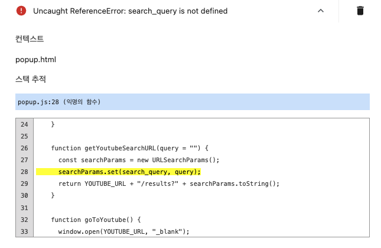

예전부터 만들어야지 생각하면서 계속 미뤄뒀던.. 확장 프로그램을 드디어 만들어서 간략하게 개발 과정을 작성해 보는 포스팅이다.

## _**개발 이유**_

이 조그만걸 왜 만들었냐면... 2019년부터 몇년간 잘 쓰던 확장 프로그램이 있었는데, 기능이 그렇게 많지 않았지만 나에게 딱 필요한 기능만 있었기에 아주 잘 쓰고 있었다.

그 확장 프로그램의 기능은

1.  프로그램 아이콘을 누르면 검색 팝업이 뜬다.
2.  그 상태로 아무것도 검색하지 않고 엔터를 누르면 바로 새 탭이 열리며 유튜브 페이지로 이동된다.
3.  검색창에 검색어를 치면 추천 검색어가 밑에 표시된다.
4.  엔터를 누르면 유튜브에 해당 검색어를 검색한 결과가 새 탭으로 열리며 유튜브 페이지로 이동된다.

정도로 아주 간단하고 군더더기 없었는데, 몇년간 정말 잘 썼었다. 하지만 그 뒤로 한차례의 대규모 크롬 업데이트를 거친 뒤에 더 이상 그 프로그램을 쓸 수 없게 되어서 다른 비슷한 유튜브 확장 프로그램을 사용했지만, 동일한 기능이 아니었기에 계속 작은 아쉬움이 있었고, 개발을 배운 뒤에는 내가 만들면 좋겠다는 생각을 늘 갖고 있었다.

&nbsp;

## _**개발 과정**_

가장 먼저 [크롬 개발자 페이지](https://developer.chrome.com/docs/extensions?hl=ko&_gl=1*14e8fz3*_up*MQ..*_ga*MTY4MDgxMTk5LjE3MTMyNzAyMzA.*_ga_H1Y3PXZW9Q*MTcxMzI3MDIyOS4xLjAuMTcxMzI3MDIyOS4wLjAuMA.. "크롬 개발자 페이지")를 참고했다. 구글 캘린더 API 연동할 때 설명이 너무 불친절해서 조금 헤맸던 기억이 있었기에 긴장했는데, 개발 자체도 어렵지 않아 보였고, 설명도 잘 되어 있었다.

### _**manifest.json**_

노드에 package.json 이 있다면 크롬 확장 프로그램에는 manifest.json 이라는 파일이 필요한데, 기능이 그렇게 많은 프로그램이 아니라서 최소한으로 간단하게 작성했다.

이름도 정말 간단하게 Quick Youtube Search로 지었고, 아이콘을 누른 후 팝업창이 뜨면 검색하는 방식으로 동작하기에 연결되는 팝업 파일 이름도 popup.html로 지었다. 공식 문서에 따르면 2 버전은 올해 6월부터 deprecated 될 예정이고, 앞으로의 최신 표준 버전은 3 버전이기에 3 버전으로 적용시켰다.

&nbsp;

### _**popup.html & popup.css**_

html 과 css를 정말 오랜만에 다뤄서 힘들었다. html 은 결제 연동 테스트할 때 샘플 페이지 띄우는 작업 때문에 종종 만져보긴 했지만 css는 그동안 사용한 적이 없어서 고생을 많이 했다.. 일부러 디자인이라고 할만한 요소조차 없게 만들었는데도 시간이 오래 걸렸다. 특히 간격 조정하느라 힘들었는데, 예전에 개발 처음 배울 때 padding 이랑 margin 때문에 고생했던 기억이 떠오르기도 했다.

&nbsp;

### _**popup.js**_

동작 로직이 담겨 있는 파일이다. 내가 넣은 기능은 이전에 내가 잘 쓰던 프로그램의 기능과 유사한데, 아주 간단한 기능을 하나 추가했다.

1.  프로그램 아이콘을 누르면 검색 팝업이 뜬다.
2.  그 상태로 아무것도 검색하지 않고 엔터를 누르면 바로 새 탭이 열리며 유튜브 페이지로 이동된다.
3.  엔터를 누르면 유튜브에 해당 검색어를 검색한 결과가 새 탭으로 열리며 유튜브 페이지로 이동된다.
4.  팝업의 유튜브 아이콘을 누르면 새 탭이 열리며 유튜브 페이지로 이동된다. -> New!

이전 프로그램에 있었던 추천 검색어 기능을 넣으려고 찾아보니 유튜브에서 제공하는 API 가 따로 없고, 추천 검색어 결과를 받아서 내가 리스트 형태로 보여주는 방식으로 개발을 해야 했다. 사실 받아서 보여주는 것 자체는 문제가 없는데, 데이터가 보이도록 html&css 조정을 하는 과정이 정말 오래 걸릴 것 같았기에 아쉽지만 이 기능은 일단 포기할 수밖에 없었다. (추후 구현할 생각 매우 있음..)

30줄 안팎의 짧은 코드였기에 js 로 간단하게 구현했지만, 브라우저 객체를 처음 다뤄보는 거였기에 타입 명시를 할 수 없어서 아쉬웠다. 아마 파일이 한 개만 더 있었어도 ts로 구현했을 것이다.

&nbsp;

&nbsp;

### _**시행착오 1**_

객체를 다루며 놓친 부분이 있었는데, 할당 방식이었다.

위의 경우는 searchParams 에 set의 반환값인 Null이 할당되므로

위의 방식처럼 해야 URLSearchParams 객체가 생성되고 searchParams에 할당된 후에, set 을 통해 값 세팅이 정상적으로 될 수 있었다.

### _**시행착오 2**_

js 코드를 자꾸 리팩토링하면서 만지다 보니 에러가 발생했는데, 코드를 아무리 봐도 뭐가 잘못된 건지 모르겠어서 디버깅 방법이 있나 찾아봤다. 찾아보니 크롬 확장 프로그램 관리페이지에서 오류 디버깅이 가능했고, 보기도 쉽고 편했다.

에러를 확인해보니 set 함수에 들어가야 할 매개변수가 string 타입이어야 했기에 생긴 오류였다. 이것 역시 타입 지정 언어였으면 놓치지 않았을 버그여서 아쉬웠지만, 큰 문제는 아니어서 다행이었다.

&nbsp;

&nbsp;

## _**기타 디자인(?) 요소**_

내가 만든 확장 프로그램은 기능도 생김새도 아주 간단하지만 내 형편없는 마크업 실력 덕분에 구현에 시간이 꽤 오래 소요되었다. 그래도 내가 직접 만들기에 고를 수 있는 사소한 요소들이 있어서 소소한 즐거움이 되어주었다.

### _**아이콘**_

프로그램 아이콘과 팝업 검색창 아이콘은 같은 모양으로 맞추고 싶었고, 이전에 쓰던 프로그램 아이콘이 다른 확장프로그램 아이콘들과 크기가 달랐기 때문에 전체적으로 통일감을 주기 위해 크기를 맞추고 싶었는데, 팝업 검색창 아이콘과 동일한 디자인의 정방형 아이콘을 찾을 수 없었다. 그래도 최종적으로 선택된 정방형 아이콘도 깔끔하고, 다른 아이콘들과 크기가 비슷해서 통일감이 생겼다.

### _**색**_

원래 유튜브 로고색은 너무 빨갛게 느껴져서 아이콘의 채도를 살짝 낮추었다.

### _**검색창**_

검색창 인풋도 원래는 좀 더 포커스를 주고 싶어서 외곽 볼드 처리를 했었는데, 커서가 움직이는 것도 나름의 포커스고, 기본 형태가 나은 것 같아서 뺐다.
&nbsp;

&nbsp;

## _**소감**_

이게 뭐라고 아주 뿌듯하고 너무 재밌었다. 오랫동안 해야지 해야지 생각했던 건데 몇시간 만에 만들 수 있었던 거면 진작 할걸 하는 생각도 들었다. 알고리즘 이지 난이도조차 안 되는 로직에 정말 기본적인 마크업으로만 구성된 프로그램이지만 하나부터 열까지 온전히 내 입맛에 맞출 수 있어서 개발 내내 너무 신났다. (간단한 거라서 그렇게 신났을 수도..) 꽤 오랜 기간 동안은 메뉴바의 아이콘만 봐도 뿌듯할 것 같단 생각이 든다.

&nbsp;

&nbsp;

&nbsp;

참조

[Mozilla doc](https://developer.mozilla.org/en-US/docs/Mozilla/Add-ons/WebExtensions/manifest.json)

[Chrome doc](https://developer.chrome.com/docs/extensions?hl=ko&_gl=1*14e8fz3*_up*MQ..*_ga*MTY4MDgxMTk5LjE3MTMyNzAyMzA.*_ga_H1Y3PXZW9Q*MTcxMzI3MDIyOS4xLjAuMTcxMzI3MDIyOS4wLjAuMA..)
