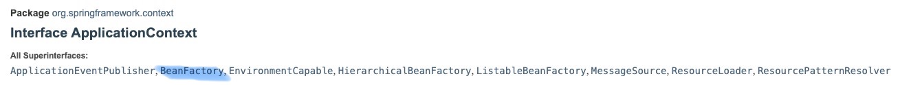
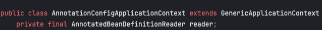

## **스프링 컨테이너**

스프링 컨테이너는 스프링에서 객체를 관리, 제공하는 역할을 한다.

### **스프링 컨테이너 생성 과정**

```java
ApplicationContext applicationContext =
  new AnnotationConfigApplicationContext();
```

- `ApplicationContext` 는 스프링 컨테이너 역할을 하며, 스프링 프레임워크의 인터페이스 중 하나이다.
- `AnnotationConfigApplicationContext` 는 `ApplicationContext` 의 구현체인 클래스인데, 이름 그대로 `Annotation` 기반의 `config` 를 토대로 스프링 애플리케이션 컨텍스트를 구성한다는 의미이다.

위의 코드는 컨테이너가 파라미터 없이 생성된 상태로, 아무 빈도 등록되어 있지 않기 때문에 `getBean()` 메서드를 호출하여 빈을 가져오면 예외가 발생할 수 있다. 보통은 파라미터로 설정 정보를 지정하고 스프링 컨테이너를 생성할 때 파라미터로 넘어온 설정 클래스 정보를 사용하여 스프링 빈을 등록한다.

&nbsp;

```java
// AppConfig.java

@Configuration
public class AppConfig {

    @Bean
    public MemberService memberService() {
        return new MemberServiceImpl(memberRepository());
    }

    @Bean
    public MemberRepository memberRepository() {
        return new MemberMemoryRepository();
    }

    @Bean
    public OrderService orderService() {
        return new OrderServiceImpl(memberRepository(), discountPolicy());
    }

    @Bean
    public DiscountPolicy discountPolicy() {
        return new FixDiscountPolicy();
    }
}
```

위와 같이 `AppConfig.java` 파일이 존재할 때,

```java
ApplicationContext applicationContext =
  new AnnotationConfigApplicationContext(AppConfig.class);
```

`AnnotationConfigApplicationContext` 생성시 파라미터로 구성 정보를 지정해주면 스프링 컨테이너가 생성되면서 `AppConfig.class` 의 정보들을 사용하여 스프링 빈을 등록한다. 이때 스프링 컨테이너는 구성 정보를 토대로 스프링 빈 의존성을 주입한다. 위의 `AppConfig` 를 토대로 의존성을 주입하면,

- `memberService <- memberRepository` : memberService 가 memberRepository 에 의존한다.
- `orderService <- memberRepository, discountPolicy` : orderService 가 memberRepository, discountPolicy 에 의존한다.

스프링 컨테이너는 빈을 생성하고 관리하는 역할을 하며, 빈이 생성되고 소멸되기까지의 생명 주기를 관리한다.

&nbsp;

### **빈 팩토리**

`ApplicationContext` 를 살펴보면 `BeanFactory` 를 포함한 다양한 인터페이스를 상속받았음을 알 수 있다.



Spring 프레임워크에서 빈 팩토리는 `Spring IoC(Inversion of Control)` 컨테이너의 최상위 인터페이스 중 하나로, 애플리케이션에서 관리되는 객체인 `빈(bean)` 을 생성하고 관리하는 역할을 한다. 즉, `ApplicationContext` 가 빈 팩토리를 상속받았기 때문에 빈 관리 기능을 제공하는 것이다.

&nbsp;

&nbsp;

## **스프링 빈**

스프링 빈은 스프링에서 제공해주는 객체로, 스프링 컨테이너가 생성하고 관리한다.

### **빈 등록 방식**

스프링은 빈을 스프링 컨테이너에 등록하기 위해 XML 파일 설정, Annotation 등 다양한 방법을 제공하는데, 이때 `BeanDefinition` 을 사용한다. `BeanDefinition` 은 스프링 컨테이너가 관리하는 객체의 메타데이터를 담고 있는 인터페이스이다. 이를 통해 스프링은 빈의 생성, 초기화, 의존성 주입 등을 수행할 수 있다.
스프링 컨테이너는 추상화된 `BeanDefinition` 를 기반으로 스프링 빈을 생성하기 때문에 설정 형식은 알 필요가 없다.



- `AnnotationConfigApplicationContext` 는 `AnnotatedBeanDefinitionReader` 를 사용해서 파라미터로 지정된 구성 정보를 읽고 `BeanDefinition` 을 생성한다.
- 동일한 방식으로, 새로운 형식의 설정 정보가 추가되면, `~BeanDefinitionReader` 를 만들어서 `BeanDefinition` 을 생성하면 된다.

&nbsp;
