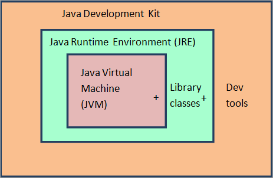
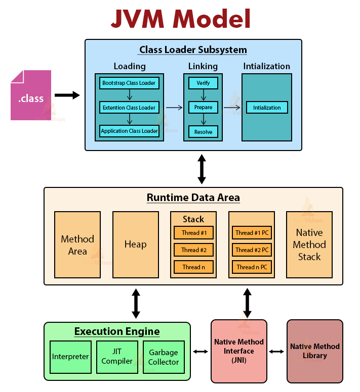
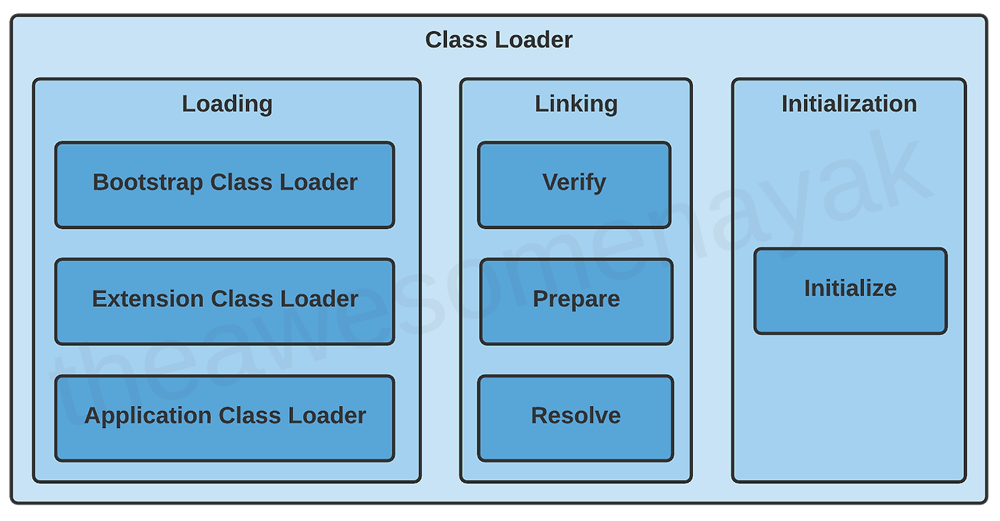
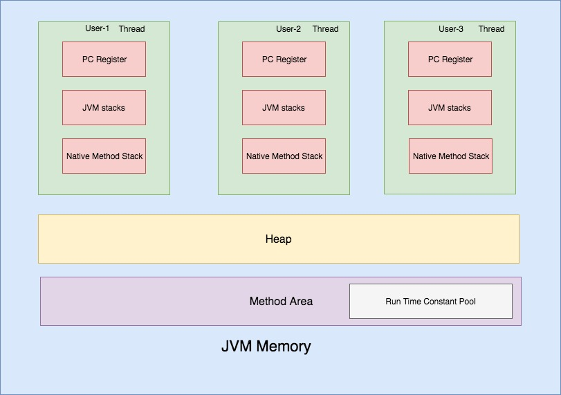
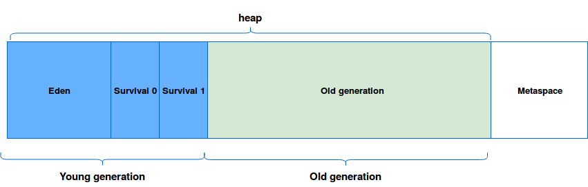
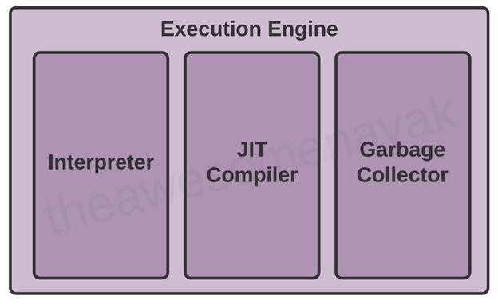

자바 아키텍처에는 3가지 구성요소가 있다.
&nbsp;

&nbsp;

&nbsp;

### **JDK(Java Development Kit)**

자바 개발 키트는 자바 컴파일러, 디버거, 런타임 환경 등 자바 프로그램을 개발하고 실행하는데에 필요한 도구와 라이브러리를 제공한다.

### **JRE(Java Runtime Environment)**

JVM 과 런타임 라이브러리 등으로 구성된 자바 어플리케이션을 실행할 환경이다.

### **JVM(Java Virtual Machine)**

**JVM(Java Virtual Machine, 자바 가상 기계)은 컴파일된 바이트 코드 파일을 운영체제에서 실행 가능한 기계어로 번역해서 실행할 수 있게 해주며, JRE(Java Runtime Env.) 의 일부**이다. 각 운영체제의 JVM 은 바이트 코드 파일을 해당 운영체제에서 실행 가능한 기계어로 번역해서 실행하기 때문에 **운영체제의 제약을 받지 않는 프로그램 개발이 가능**하다.
&nbsp;

&nbsp;

이 중에서 오늘은 JVM 을 이해하는 것이 목적이다.
&nbsp;

&nbsp;

JVM 에는 세가지 구성요소가 있다.

1. 클래스로더 (Class Loader)
2. 런타임 메모리 영역 (Runtime Data Area)
3. 실행 엔진 (Execution Engine)

## **클래스로더**

클래스로더는 java.lang 패키지에 있는 추상 클래스로, .java 파일이 컴파일되어 바이트 코드를 포함한 동일한 이름을 가진 .class 파일이 생성되면 클래스로더가 .class 파일을 읽고 상응하는 이진 데이터를 생성해 JVM 내의 메서드 영역으로 동일한 이름의 클래스 파일을 로드한다.

클래스로더는 **로딩(Loading) -> 링킹(Linking) -> 초기화(Initialization)** 의 순서로 작업을 수행한다.
&nbsp;

&nbsp;

### **로딩**

클래스로더에는 몇가지 종류가 있으며 계층적으로 구성되어 있다.

- 부트스트랩 클래스로더: **가장 먼저 실행되는 루트 클래스로더**로, $JAVA HOME/jre/lib directory 에서 표준 자바 패키지를 가져온다.
- 익스텐션 클래스로더: 두번째로 실행되는 클래스로더로, 부트스트랩 클래스로더의 자식이자 어플리케이션 클래스로더의 부모이다. $JAVA_HOME/jre/lib/ext directory 에서 표준 자바 라이브러리를 가져온다.
- 어플리케이션 클래스로더: 마지막으로 실행되는 클래스로더로, 익스텐션 클래스로더의 자식이다. 자바 어플리케이션 파일을 가져와서 실행한다.

계층적 구조에 의해 클래스로더는 부모 클래스로더로부터 클래스를 로드하고 찾지 못할 경우 자식 클래스로더에게 로드를 위임하는 방식으로 동작한다. 이러한 클래스로더의 동작 방식은 **클래스의 중복 로딩을 방지하고 클래스 간의 의존성을 관리**하는 데에 도움이 된다.

### **링킹**

로딩 이후 클래스로더는 파일을 링킹한다. 이 과정에는 클래스로더가 파일을 검증, 준비, 해결하는 단계가 포함되어 있다.

- 검증(verification): ByteCodeVerifier 라는 컴포넌트가 로딩된 .class 파일이 검증된 컴파일러에 의해 컴파일된건지, 구조가 유효한지 등을 검증한다. 검증이 실패하면 런타임 에러가 발생한다.
- 준비(preparation): 만약 클래스에 인스턴스 요소나 정적 변수가 있다면 기본값을 할당한다.
- 해결(resolution): 자바 클래스는 다른 클래스에 대한 참조를 포함할 수 있는데, 이러한 참조는 심볼릭 링크로 표현된다. 해결 과정에서 클래스로더는 심볼릭 링크를 직접적 링크로 대체한다.

### **초기화**

초기화 단계에서는 정적 변수를 초기화한다.
&nbsp;

&nbsp;

---

## **런타임 데이터 영역 (Runtime Data Area)**

런타임 데이터 영역은 JVM 이 실행되는 동안 프로그램이 사용하는 데이터를 저장하는 메모리 영역으로,

- 메서드 영역 (Method Area)
- 힙 영역 (Heap Area)
- 스택 영역 (Stack Area)
- PC 레지스터 (Program Counter Register)
- 네이티브 메서드 스택 (Native Method Stack) 의 다섯가지 영역으로 이루어져 있다.
  &nbsp;

  &nbsp;

&nbsp;

### **메서드 영역 (Method Area)**

메서드, 필드, 상수 풀, 메타데이터 등의 클래스 정보를 저장하며, 모든 스레드가 공유하는 영역이다.

런타임 상수 풀(Runtime Constant Pool) 이라는 자바 클래스 파일의 구성 요소가 존재하는데, 클래스 파일에 포함된 상수 풀(Constant Pool)의 런타임 버전이다. 즉, 클래스 파일에 정의된 상수들의 런타임 시점에서의 표현을 담고 있다. 자바 컴파일러가 소스 코드를 컴파일하여 클래스 파일을 생성할 때, 상수 풀은 클래스 파일에 상수 값들을 저장하고, 필요한 경우 런타임 중에 상수들을 참조하고 사용할 수 있도록 한다. 이를 통해 자바 프로그램은 동적으로 상수들을 참조하고 변경할 수 있다.
&nbsp;

&nbsp;

### **힙 영역 (Heap Area)**

객체 인스턴스가 생성되는 영역으로, 동적으로 할당된 메모리를 저장한다. GC(Garbage Collection) 의 대상이 되는 메모리 영역으로, 더 이상 사용되지 않는 객체의 메모리를 회수한다. 힙 영역은 모든 스레드가 공유한다.

- Young gen: 새롭게 생성된 클래스 인스턴스들이 저장된다.
  - Eden: 새롭게 생성된 클래스 인스턴스들이 저장되는 곳으로, Eden 영역이 가득 차면, Minor GC(Garbage Collection) 가 발생하여 Eden 영역에 있는 살아있는 객체들을 체크하고, 살아남은 객체들은 Survivor 영역으로 이동된다. 이후 Eden 영역은 비워진다.
  - Survivor: 이 영역에서 살아남은 객체들은 Old Generation 으로 이동될 수 있다.
- Old gen: Young Gen 에서 일정 주기마다 살아남은 객체들이 이동하는 영역이다.

  - 상대적으로 큰 메모리 공간을 가지고 있으며, 오랜 시간 동안 살아남은 객체들이 저장된다.
  - Old Generation에 있는 객체들은 GC가 발생할 때마다 검사되며, 더 이상 참조되지 않는 객체들은 메모리에서 해제된다.

&nbsp;

### **스택 영역 (Stack Area)**

메서드가 호출되면 새로운 스택 프레임이 생성되는데, 이 스택 프레임이 스택 영역에 저장된다. 메서드의 실행이 종료되거나 에러가 발생하면 스택에서 해당 프레임이 제거된다. 스택 영역은 각 스레드마다 하나씩 존재하며 스레드가 시작될 때 할당된다.

### **PC 레지스터 (Program Counter Register)**

현재 실행 중인 JVM 명령어의 주소를 저장한다. 각 스레드마다 별도로 할당되며, 스레드가 실행될 때마다 초기화된다.

### **네이티브 메서드 스택 (Native Method Stack)**

자바 외부에서 호출되는 네이티브 코드(C 나 C++ 로 작성된 코드) 를 실행하는 데에 사용되는 메모리 영역이다. 스택 영역과 마찬가지로 메서드를 호출할 때마다 해당 스택 프레임이 생성되며, 네이티브 메서드 실행이 종료되면 해당 스택 프레임이 제거된다.
&nbsp;

&nbsp;

---

## **실행 엔진 (Execution Engine)**

실행 엔진은 JVM 내부에서 Java 바이트 코드를 해석하고 실행하는 역할을 하며

- 인터프리터 (Interpreter)
- JIT 컴파일러 (Just-In-Time Compiler)
- GC (Garbage Collection) 으로 구성되어 있다.

### **인터프리터 (Interpreter)**

Java 바이트 코드를 한 줄씩 읽어들여서 해당 코드를 직접 실행한다. 이 때문에 코드 실행 속도가 느릴 수 있다.

### **JIT 컴파일러 (Just-In-Time Compiler)**

인터프리터와 함께 사용된다. JIT 컴파일러는 인터프리터가 반복적으로 실행되는 코드를 감지하고, 해당 코드를 네이티브 기계 코드로 컴파일하여 최적화한다. 생성된 네이티브 코드는 캐시에 저장되어 동일한 코드가 실행될 때 재사용된다. 이를 통해 코드 실행 속도를 향상시킬 수 있다.

### **GC (Garbage Collection)**

GC는 JVM 에서 메모리 관리를 위해 사용되는 프로세스이다. GC는 주기적으로 메모리를 검사하여 사용되지 않는 객체를 식별하여 메모리를 해제한다. GC는 JVM 의 일부로 자동으로 실행되며, 개발자가 직접 관여할 필요가 없다.
&nbsp;

&nbsp;

&nbsp;

&nbsp;

참조

https://www.freecodecamp.org/news/jvm-tutorial-java-virtual-machine-architecture-explained-for-beginners/
https://www.geeksforgeeks.org/jvm-works-jvm-architecture/
