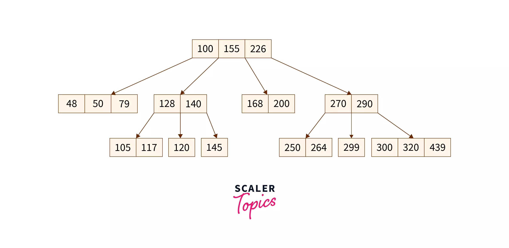

## **인덱스(Index)**

&nbsp;

### 특징

DBMS 에서 사용되는 인덱스는 자료 구조 중 하나인 SortedList 와 유사하다. SortedList 는 저장되는 값을 항상 정렬된 상태로 유지하는 자료구조로, DBMS 에서 사용되는 인덱스도 SortedList 와 마찬가지로 저장되는 칼럼의 값을 이용해 항상 정렬된 상태를 유지한다.

이러한 특징에 의해 여러 장단점이 존재하게 된다.

- SortedList 는 데이터가 저장될 때마다 항상 값을 정렬해야 하므로 저장하는 과정이 복잡하고 느리지만, 이미 정렬되어 있기 때문에 원하는 값을 빨리 찾아올 수 있다. 이와 마찬가지로 DBMS 의 인덱스도 인덱스가 많은 테이블은 당연히 INSERT, UPDATE, DELETE 문의 처리가 느려진다. 하지만 이미 정렬되어 있기 때문에 `단순히 조회하는 용도인 SELECT 문은 매우 빠르게 처리`할 수 있다.
- DBMS 에서 인덱스는 `데이터의 저장(INSERT, UPDATE, DELETE) 성능을 희생하고 그 대신 데이터의 읽기 속도를 높이는 기능`이라고 할 수 있다. 따라서 테이블에 인덱스를 추가할 때에는 데이터의 저장 속도와 읽기 속도를 비교하여 결정해야 한다. SELECT 쿼리문의 WHERE 조건절에 사용되는 컬럼이라고 해서 전부 인덱스로 생성하면 데이터 저장 성능이 떨어지고 인덱스의 크기가 비대해져 오히려 역효과만 불러올 수 있다.

&nbsp;

### 역할별 구분

#### 프라이머리 인덱스 (Primary Index)

프라이머리 인덱스는 데이터베이스 테이블에서 `레코드의 식별을 고유하게 보장하기 위해 사용되는 기본 인덱스`이다. 프라이머리 키(Primary Key) 와 연관되어 있으며, 해당 키가 인덱스로 설정된 것이기 때문에 NULL 값을 허용하지 않으며 중복을 허용하지 않는다. 대부분의 관계형 데이터베이스는 테이블을 생성할 때 프라이머리 키를 지정하면 자동으로 프라이머리 인덱스를 생성하기 때문에 별도로 인덱스를 만들지 않아도 된다.

#### 세컨더리 인덱스 (Secondary Index)

세컨더리 인덱스는 프라이머리 인덱스를 제외한 나머지 모든 인덱스를 말하며, `보조적으로 검색 성능을 향상시키는 역할`을 한다. 세컨더리 인덱스 중에서도 유니크 인덱스는 특정 컬럼이나 컬럼 조합에 대해 고유한 값만을 허용하도록 하는 인덱스이다. 프라이머리 인덱스와 성격이 비슷하지만, 프라이머리 인덱스는 한 테이블에 하나만 생성할 수 있는 반면 `유니크 인덱스는 여러 개 생성`할 수 있다. 또한, 프라이머리 키는 NULL 값을 허용하지 않지만, 유니크 인덱스는 일부 데이터베이스에서 NULL 값을 허용한다는 차이점이 있다.

&nbsp;

### 데이터 저장 방식(알고리즘)별 구분

#### B-Tree 알고리즘

가장 일반적으로 사용되는 인덱스 알고리즘으로, `칼럼의 값을 변형하지 않고 원래의 값을 이용해 인덱싱`하는 알고리즘이다. 

#### Hash 인덱스 알고리즘

`칼럼의 값으로 해시값을 계산해서 인덱싱하는 알고리즘`으로, 매우 빠른 검색을 지원한다. 값을 변형해서 인덱싱하므로 전방(Prefix) 일치와 같이 값의 일부만 검색하거나 범위를 검색할 때는 해시 인덱스를 사용할 수 없다. 

&nbsp;

&nbsp;

## B-Tree 인덱스

### 구조 및 특성

B-Tree 는 트리 구조의 최상위에 하나의 `루트 노트`가 존재하고 그 하위에 자식 노드가 붙어 있는 형태다. 트리 구조의 가장 하위에 있는 노드를 `리프 노드`라 하고, 트리 구조에서 루트 노드도 아니고 리프 노드도 아닌 중간의 노드를 `브랜치 노드`라고 한다. 데이터베이스에서 인덱스와 실제 데이터가 저장된 데이터는 따로 관리되는데, `인덱스의 리프 노드는 항상 실제 데이터 레코드를 찾아가기 위한 주솟값을 가지고 있다.`

위의 그림과 같이 인덱스의 키 값은 모두 정렬되어 있지만, 데이터 파일의 레코드는 정렬되어 있지 않고 임의의 순서로 저장되어 있다. `레코드가 삭제되어 빈 공간이 생기면 그 다음의 INSERT 는 가능한 한 삭제된 공간을 재활용하도록 설계`되어 있기 때문에 순서대로 저장되지는 않는다. 

인덱스는 테이블의 키 칼럼만 가지고 있으므로 나머지 칼럼을 읽으려면 데이터 파일에서 해당 레코드를 찾아야 한다. 이를 위해 인덱스의 리프 노드는 데이터 파일에 저장된 레코드의 주소를 가진다.

&nbsp;

### B-Tree 인덱스 키 추가 및 삭제

#### 인덱스 키 추가

새로운 키 값이 B-Tree 에 저장될 때 테이블의 스토리지 엔진에 따라 새로운 키 값이 즉시 인덱스에 저장될 수도 있고 그렇지 않을 수도 있다. B-Tree 에 저장될 때, 저장딜 키 값을 이용해 B-Tree 상의 적절한 위치를 검색해야 한다. 저장될 위치가 결정되면 레코드의 키 값과 대상 레코드의 주소 정보를 B-Tree 리프 노드에 저장한다. 이때 리프 노드가 꽉 차서 더이상 저장할 수 없을 경우 리프 노트가 분리되어야 하는데, 이는 상위 브랜치 노드까지 처리 범위가 넓어지게 된다. 이러한 작업 탓에 B-Tree 는 상태적으로 쓰기 작업, 즉 새로운 키를 추가하는 작업에 비용이 많이 드는 것으로 알려졌다.

#### 인덱스 키 삭제

B-Tree 의 키 값을 삭제할 때는 해당 키 값이 저장된 B-Tree 의 리프 노드를 찾아서 삭제 마크를 하면 된다. 이런식으로 삭제 마킹된 인덱스 키 공간은 계속 방치하거나 재활용할 수 있다.

#### 인덱스 키 변경

인덱스 키 값은 그 값에 따라 저장될 리프 노드의 위치가 결정되므로 B-Tree 의 키 값이 변경되는 경우에는 단순히 인덱스상의 키 값만 변경하는 것은 불가능하다. 결국 인덱스 키 값을 변경하는 작업은 `기존 인덱스 키 값을 삭제한 후 새로운 인덱스 키 값을 추가하는 작업`으로 처리된다.

#### 인덱스 키 검색

쓰기 작업을 할 때 인덱스 관리에 따르는 추가 비용을 감당하면서 인덱스를 구축해는 이유는 바로 빠른 검색을 위해서다. 인덱스를 검색하는 작업은 B-Tree 의 `루트 노드부터 시작해 브랜치 노드를 거쳐 최종 리프 노드까지 이동하면서 비교 작업을 수행`하는데, 이 과정을 `트리 탐색`이라고 한다. B-Tree 인덱스를 이용한 검색은 100% 일치 또는 값 앞부분만 일치하는 경우에 사용할 수 있다. 

인덱스의 키 값에 변형이 가해지면 변형된 값은 B-Tree 인덱스에 존재하는 값이 아니기 때문에 절대 B-Tree 의 빠른 검색 기능을 사용할 수 없다.

&nbsp;

### B-Tree 인덱스 사용에 영향을 미치는 요소

#### 인덱스 키 값의 크기

일반적으로 DBMS 의 B-Tree 는 자식 노드의 개수가 가변적인 구조인데, 이때 `자식 노드의 개수는 인덱스의 페이지 크기와 키 값의 크기에 따라 결정`된다. 인덱스 페이지에 키가 저장될 때, 키 값의 크기가 클수록 저장 가능한 인덱스 키의 개수가 자연스럽게 줄어들게 되고, 이는 한번에 읽을 수 있는 레코드 개수에 영향을 끼치게 된다. 결국 `인덱스를 구성하는 키 값의 크기가 커지면 디스크로부터 읽어야 하는 횟수가 늘어나고, 그만큼 느려진다`는 것을 의미한다.

또한 인덱스 키 값의 길이가 길어진다는 것은 전체적인 인덱스의 크기가 커진다는 것을 의미한다. 인덱스를 캐시해두는 버퍼 풀이나 키 캐시 영역은 크기가 제한적이기 때문에 `하나의 레코드를 위한 인덱스 크기가 커지면 커질수록 메모리에 캐시해 둘 수 있는 레코드 수는 줄어든다.` 그렇게 되면 자연히 메모리의 효울이 떨어지는 결과를 가져온다.

#### 데이터 선택도

인덱스 선택도는 모든 인덱스 키 값 가운데 유니크한 값의 수를 의미한다. 인덱스 키 값 가운데 중복된 값이 많아지면 많아질수록 선택도는 떨어진다. 인덱스는 선택도가 높을수록 검색 대상이 줄어들기 때문에 그만큼 빠르게 처리된다.

&nbsp;

### B-Tree 인덱스를 통한 데이터 읽기

#### 인덱스 레인지 스캔

인덱스 레인지 스캔은 인덱스의 접근 방법 가운데 가장 대표적인 접근 방식으로, `검색해야 할 인덱스의 범위가 결정됐을 때 사용하는 방식`이다. 루트 노드에서부터 비교를 시작해 브랜치 노드를 거치고 최종적으로 리프 노드까지 찾아 들어가야만 비로소 필요한 레코드의 시작 지점을 찾을 수 있다. 일단 시작해야 할 위치를 찾으면 그때부터는 리프 노드의 레코드만 순서대로 읽으면 된다. 이 과정을 인덱스 스캔이라고 표현한다. 만약 스캔하다가 리프 노드의 끝까지 읽으면 리프 노드간의 링크를 이용해 다음 리프 노드를 찾아서 다시 스캔한다. 그리고 최종적으로 스캔을 멈춰야 할 위치에 다다르면 지금까지 읽은 레코드를 사용자에게 반환하고 쿼리를 끝낸다.

#### 인덱스 풀 스캔

인덱스 레인지 스캔과는 달리 `인덱스의 처음부터 끝까지 모두 읽는 방식`을 인덱스 풀 스캔이라고 한다. 대표적으로 쿼리의 조건절에 사용된 칼럼이 인덱스의 첫번째 칼럼이 아닌 경우 인덱스 풀 스캔 방식이 사용된다. 일반적으로 인덱스의 크기는 테이블의 크기보다 작으므로 직접 테이블을 처음부터 끝까지 읽는 것보다는 인덱스만 읽는 것이 효율적이다. `쿼리가 인덱스에 명시된 칼럼만으로 조건을 처리할 수 있는 경우 주로 이 방식이 사용`된다. 인덱스뿐만 아니라 데이터 레코드까지 모두 읽어야 한다면 절대 이 방식으로 처리되지 않는다. 먼저 인덱스 리프 노드의 제일 앞 또는 제일 뒤로 이동한 후, 인덱스의 리프 노드를 연결하는 연결리스트를 따라서 처음부터 끝까지 스캔하는 방식이다.

#### 루스 인덱스 스캔

말 그대로 느슨하게 인덱스를 읽는 것을 의미한다. 인덱스 레인지 스캔과 비슷하게 작동하지만 중간에 `필요치 않은 인덱스 키 값은 무시하고 다음으로 넘어가는 형태`로 처리한다.

